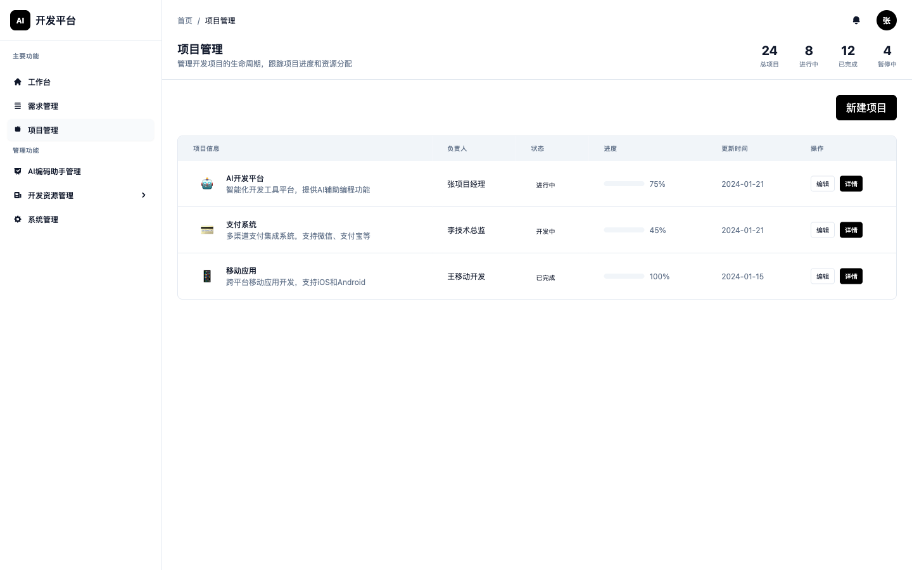
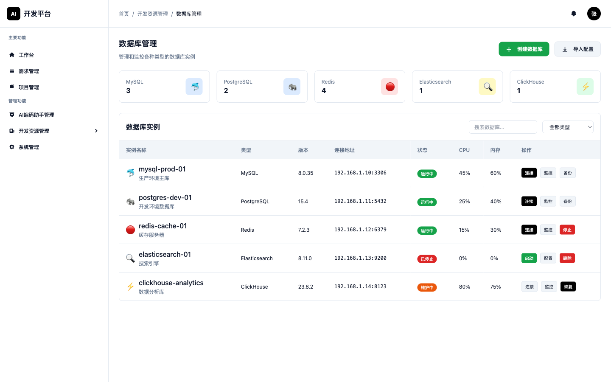

# AI开发平台 (AI Development Platform)

<div align="center">


**一个集成AI能力的全流程DevOps开发平台**

[功能特性](#功能特性) • [技术架构](#技术架构) • [快速开始](#快速开始) • [项目结构](#项目结构) • [开发指南](#开发指南)

</div>

---

## 📋 项目概述

AI开发平台是一个基于AI驱动的全流程DevOps开发平台，旨在通过人工智能技术提升软件开发效率，实现从需求收集到部署监控的完整开发生命周期管理。

### 🎯 核心价值

- **AI驱动**: 集成多种AI能力，包括需求分析、代码生成、代码审查、测试用例生成等
- **全流程覆盖**: 涵盖需求管理、开发管理、代码管理、部署管理、监控运维等完整DevOps流程
- **高效协作**: 支持多角色协作，包括产品经理、开发者、测试工程师、DevOps工程师等
- **智能化**: 通过AI辅助决策，提升开发质量和效率

## ✨ 功能特性

### 🏠 工作台模块


- **个人工作台**: 统一的工作入口，展示个人任务、项目进度、AI助手状态
- **今日任务**: 智能任务管理，支持优先级排序和进度跟踪
- **快速操作**: 常用功能的快速访问入口
- **数据统计**: 个人和团队的工作效率统计

### 🤖 AI插件管理


- **插件市场**: 丰富的AI插件生态，支持代码生成、需求分析、测试等多种场景
- **插件配置**: 灵活的插件配置管理，支持个性化定制
- **使用统计**: 详细的插件使用数据分析
- **状态监控**: 实时监控插件运行状态和性能

### 🔄 开发流程


- **AI代码生成**: 基于自然语言描述生成高质量代码
- **需求分析**: AI辅助需求理解和技术方案设计
- **代码审查**: 智能代码质量检查和优化建议
- **测试生成**: 自动生成测试用例和测试脚本

### 📊 项目管理



- **项目概览**: 项目进度、团队成员、资源使用情况统计
- **任务分配**: 智能任务分配和工作量评估
- **进度跟踪**: 实时项目进度监控和风险预警
- **团队协作**: 支持多人协作和沟通工具集成

### 📈 运维监控


- **系统监控**: 服务器、数据库、应用性能实时监控
- **告警管理**: 智能告警规则配置和通知机制
- **性能分析**: 深度性能分析和优化建议
- **日志管理**: 集中化日志收集和分析

### 🛠 开发资源管理


- **服务器管理**: 云服务器资源的统一管理和监控
- **数据库管理**: 多种数据库的管理和维护
- **容器管理**: Docker容器和Kubernetes集群管理
- **存储管理**: 文件存储和对象存储的统一管理

#### 服务器管理详情


#### 数据库管理详情



#### 代码管理详情


### ⚙️ 系统管理


- **用户管理**: 用户账户、角色权限管理
- **权限控制**: 细粒度的权限控制和访问管理
- **系统配置**: 平台参数配置和环境管理
- **审计日志**: 完整的操作审计和安全日志

## 🏗 技术架构

### 前端技术栈
- **HTML5**: 现代化的页面结构
- **Tailwind CSS**: 原子化CSS框架，支持响应式设计
- **原生JavaScript (ES6+)**: 高性能的交互逻辑实现
- **模块化架构**: 清晰的代码组织和模块分离

### 设计规范
- **黑白极简主题**: 参考shadcn/ui的现代化设计风格
- **响应式设计**: 支持桌面端、平板和移动端
- **无障碍访问**: 遵循WCAG 2.1标准
- **国际化支持**: 多语言界面支持

### 核心特性
- **零依赖**: 无需复杂的构建工具和框架依赖
- **高性能**: 原生JavaScript实现，加载速度快
- **可扩展**: 模块化架构，易于功能扩展
- **兼容性**: 支持现代浏览器 (Chrome 90+, Firefox 88+, Safari 14+, Edge 90+)

## 🚀 快速开始

### 环境要求
- 现代浏览器 (推荐Chrome 90+)
- 本地Web服务器 (可选)

### 安装运行

#### 方式一：直接运行
```bash
# 克隆项目
git clone https://github.com/zhangyingwei/ai-dev-platform.git

# 进入项目目录
cd ai-dev-platform

# 直接在浏览器中打开
open prototype/index.html
```

#### 方式二：本地服务器
```bash
# 使用Python
cd prototype
python -m http.server 8000

# 使用Node.js
npx serve prototype

# 使用PHP
cd prototype
php -S localhost:8000

# 访问 http://localhost:8000
```

### 功能演示

1. **导航体验**: 点击左侧导航菜单切换不同功能模块
2. **工作台**: 查看个人任务和项目统计信息
3. **AI插件**: 体验AI插件的配置和使用
4. **项目管理**: 查看项目列表和详细信息
5. **响应式**: 调整浏览器窗口查看响应式效果

## 📁 项目结构

```
ai-dev-platform/
├── README.md                          # 项目说明文档
├── docs/                              # 项目文档
│   ├── AI开发平台初步需求.md           # 初步需求文档
│   ├── AI开发平台功能清单表格.md       # 功能清单
│   ├── AI开发平台详细功能设计文档.md   # 详细设计文档
│   ├── AI开发平台详细需求规格说明书.md # 需求规格说明
│   ├── 系统UI设计文档.md              # UI设计规范
│   └── 需求分析报告_*.md              # 需求分析报告
├── prototype/                         # 原型系统
│   ├── index.html                     # 主页面入口
│   ├── main.html                      # 主应用页面
│   ├── css/                           # 样式文件
│   │   └── styles.css                 # 自定义样式
│   ├── js/                            # JavaScript文件
│   │   ├── app.js                     # 主应用逻辑
│   │   └── modules.js                 # 模块内容定义
│   ├── pages/                         # 页面文件
│   │   ├── ai-agents.html             # AI插件管理页面
│   │   ├── development-workflow.html  # 开发流程页面
│   │   ├── project-management.html    # 项目管理页面
│   │   ├── operations-monitoring.html # 运维监控页面
│   │   ├── resource-management.html   # 资源管理页面
│   │   ├── system-management.html     # 系统管理页面
│   │   └── workspace.html             # 工作台页面
│   └── README.md                      # 原型说明文档
└── .augment-guidelines                # 开发规范
```

## 🛠 开发指南

### 代码规范
- 遵循ES6+标准
- 使用语义化的HTML结构
- 遵循Tailwind CSS的原子化设计理念
- 保持代码注释的完整性

### 设计规范
- 严格遵循黑白极简主题
- 保持界面的一致性和可用性
- 确保响应式设计的兼容性
- 注重用户体验和交互细节

### 贡献流程
1. Fork项目到个人仓库
2. 创建功能分支 (`git checkout -b feature/AmazingFeature`)
3. 提交更改 (`git commit -m 'Add some AmazingFeature'`)
4. 推送到分支 (`git push origin feature/AmazingFeature`)
5. 创建Pull Request

## 📖 文档资源

- [功能清单](docs/AI开发平台功能清单表格.md) - 130个功能点的详细清单
- [设计文档](docs/AI开发平台详细功能设计文档.md) - 完整的界面设计和交互规范
- [需求规格](docs/AI开发平台详细需求规格说明书.md) - PRD需求规格说明
- [UI设计规范](docs/系统UI设计文档.md) - 黑白极简主题的UI设计规范

## 🤝 贡献者

感谢所有为这个项目做出贡献的开发者！

## 📄 许可证

本项目采用 [MIT 许可证](LICENSE)。

## 📞 联系我们

- 项目地址: [https://github.com/zhangyingwei/ai-dev-platform](https://github.com/zhangyingwei/ai-dev-platform)
- 问题反馈: [Issues](https://github.com/zhangyingwei/ai-dev-platform/issues)

---

<div align="center">

**⭐ 如果这个项目对你有帮助，请给我们一个Star！**

</div>
