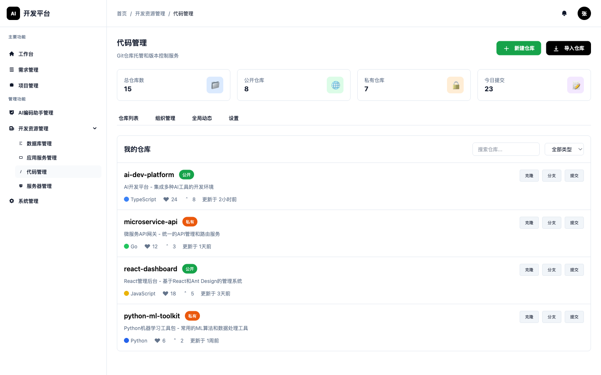
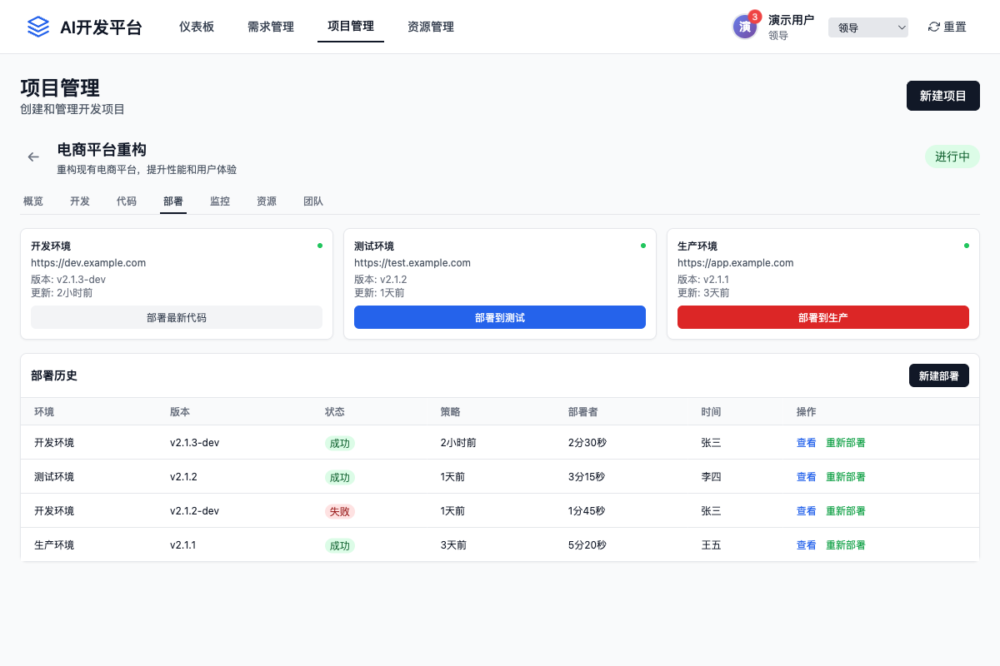

# AI开发平台

<div align="center">


*一个集需求收集、项目管理、代码开发、自动化部署、监控运维于一体的智能化开发平台*

[](LICENSE)
[](CHANGELOG.md)
[](#)

</div>

## 📖 项目概述

AI开发平台通过AI技术辅助整个软件开发生命周期，为不同角色的用户提供智能化的开发工具和管理功能，显著提高开发效率和质量。

### 🎯 核心价值

- **智能化需求收集** - 录音转文字、AI需求拆分、自动化需求分析
- **全流程项目管理** - 从需求到部署的完整项目生命周期管理
- **AI辅助编程** - 集成多种AI编程工具，提升开发效率
- **自动化运维** - CI/CD流程、多环境部署、智能监控预警

## 🚀 功能特性

### 📊 系统概览


### 👥 多角色支持

| 角色 | 主要功能 | 权限范围 |
|------|----------|----------|
| **销售/售前** | 需求收集、录音转文字、AI需求拆分 | 需求管理 |
| **领导** | 需求审批、项目决策、全局监控 | 全部功能 |
| **研发管理** | 项目管理、代码仓库管理、资源配置 | 项目、代码、部署、监控 |
| **研发人员** | 需求细化、代码审查、技术决策 | 项目、代码、部署 |
| **开发人员** | 功能开发、AI编程、代码提交 | 代码管理 |

### 🔧 核心模块

#### 1. 需求收集模块


- **录音功能** - 实时录音、质量控制、文件管理
- **语音转文字** - AI语音识别、多语言支持、实时转换
- **需求编辑** - 富文本编辑器、实时保存、版本历史
- **AI需求拆分** - 智能分析、自动拆分建议、工作量估算

#### 2. 项目管理模块


- **项目创建** - 项目模板、初始化配置、权限设置
- **人员管理** - 团队成员、角色分配、工作负载分析
- **需求管理** - 需求跟踪、状态管理、优先级控制

#### 3. 代码管理模块


- **Git仓库管理** - 版本控制、分支策略、合并请求
- **代码审查** - Pull Request流程、质量检查、审查意见
- **AI编程集成** - 多AI工具支持、Prompt管理、智能补全

#### 4. 自动化部署模块


- **CI/CD流程** - 自动化构建、测试执行、部署流程
- **环境管理** - 多环境支持、配置管理、环境隔离
- **发布策略** - 蓝绿部署、灰度发布、金丝雀发布

#### 5. 监控预警模块


- **系统监控** - 性能指标、资源监控、健康检查
- **日志管理** - 日志收集、分析、错误追踪
- **告警系统** - 实时告警、通知机制、问题定位

## 🏗️ 技术架构

### 系统架构图


### 技术栈

#### 前端技术
- **HTML5 + CSS3** - 现代Web标准
- **TailwindCSS** - 原子化CSS框架
- **JavaScript ES6+** - 现代JavaScript特性
- **IndexedDB** - 本地数据存储

#### 后端技术
- **RESTful API** - 标准化接口设计
- **微服务架构** - 服务解耦、独立部署
- **Docker容器化** - 环境一致性、快速部署
- **消息队列** - 异步处理、系统解耦

#### 数据存储
- **关系型数据库** - 结构化数据存储
- **NoSQL数据库** - 非结构化数据存储
- **文件存储系统** - 文件资源管理
- **缓存系统** - 性能优化

## 🚀 快速开始

### 环境要求

- **浏览器**: Chrome 90+, Firefox 88+, Safari 14+, Edge 90+
- **Node.js**: 16.0+ (开发环境)
- **Docker**: 20.0+ (部署环境)

### 安装步骤

1. **克隆项目**
   ```bash
   git clone https://github.com/your-org/ai-dev-platform.git
   cd ai-dev-platform
   ```

2. **启动原型演示**
   ```bash
   # 直接打开原型文件
   open prototype/index.html
   
   # 或使用本地服务器
   cd prototype
   python -m http.server 8080
   # 访问 http://localhost:8080
   ```

3. **角色切换体验**
   - 使用右上角角色选择器切换不同角色
   - 体验不同角色的功能权限
   - 测试完整的业务流程

### 演示数据

原型包含预置的演示数据：
- 5个不同角色的用户账户
- 3个示例项目
- 10+个需求案例
- 完整的部署历史记录

## 📱 功能演示

### 需求收集流程


1. 销售人员开启录音功能
2. 实时语音转文字记录
3. AI智能需求拆分
4. 提交审批流程

### 项目开发流程


1. 研发管理创建项目
2. 研发人员细化需求
3. 开发人员AI辅助编程
4. 代码审查和合并

### 自动化部署


1. 代码提交触发构建
2. 自动化测试执行
3. 多环境部署策略
4. 实时监控反馈

## 📚 文档导航

### 📖 核心文档

- [📋 需求文档](./docs/requirements.md) - 详细的功能需求和业务流程
- [🎨 设计文档](./docs/design.md) - 系统架构和技术设计
- [📝 开发计划](./docs/development-todo.md) - 开发任务和进度规划

### 🔧 开发资源

- [🔧 原型说明](./prototype/README.md) - 高保真原型使用指南
- [📸 截图指南](./docs/SCREENSHOT_GUIDE.md) - 项目截图添加指导
- [🖼️ 图片资源](./docs/images/README.md) - 项目图片和截图说明

### 📋 项目管理

- [📊 变更日志](./CHANGELOG.md) - 版本更新记录
- [🤝 贡献指南](./CONTRIBUTING.md) - 参与项目开发指南
- [📄 许可证](./LICENSE) - 项目许可证信息
- [📁 项目结构](./docs/PROJECT_STRUCTURE.md) - 项目目录结构说明

## 🤝 贡献指南

我们欢迎所有形式的贡献！请查看 [贡献指南](CONTRIBUTING.md) 了解详细信息。

### 开发流程

1. Fork 项目
2. 创建功能分支 (`git checkout -b feature/AmazingFeature`)
3. 提交更改 (`git commit -m 'Add some AmazingFeature'`)
4. 推送到分支 (`git push origin feature/AmazingFeature`)
5. 创建 Pull Request

## 📄 许可证

本项目采用 MIT 许可证 - 查看 [LICENSE](LICENSE) 文件了解详细信息。

## 📞 联系我们

- **项目主页**: [https://github.com/your-org/ai-dev-platform](https://github.com/your-org/ai-dev-platform)
- **问题反馈**: [Issues](https://github.com/your-org/ai-dev-platform/issues)
- **邮箱**: contact@ai-dev-platform.com

---

<div align="center">

**⭐ 如果这个项目对你有帮助，请给我们一个星标！**

Made with ❤️ by AI开发平台团队

</div>
