# AI开发平台详细功能设计文档

## 1. 文档信息

**文档标题**: AI开发平台详细功能设计文档
**文档版本**: v2.0
**创建日期**: 2025-01-21
**更新日期**: 2025-01-21
**设计人员**: AI产品经理
**基于架构**: 全流程DevOps AI驱动平台架构

## 2. 系统总体设计

### 2.1 业务流程架构

基于用户故事的完整DevOps流程设计：

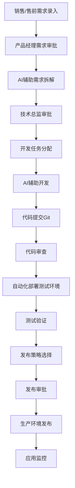

### 2.2 主菜单结构重新设计

基于全流程DevOps架构，重新设计主菜单结构：

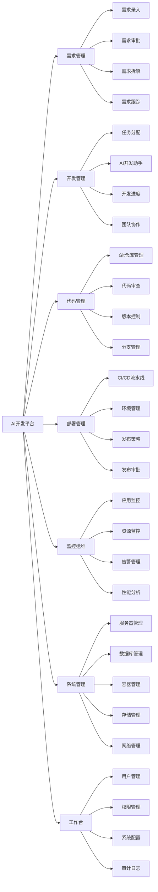

### 2.2 菜单权限设计

#### **角色权限矩阵**

| 菜单模块 | 管理员 | 项目经理 | 架构师 | 开发者 | 测试工程师 | DevOps工程师 |
|---------|-------|---------|-------|-------|-----------|-------------|
| 工作台 | ✅ | ✅ | ✅ | ✅ | ✅ | ✅ |
| AI插件管理 | ✅ | ✅ | ✅ | 🔒 | 🔒 | ✅ |
| 开发流程 | ✅ | ✅ | ✅ | ✅ | ✅ | ✅ |
| 项目管理 | ✅ | ✅ | ✅ | 👁️ | 👁️ | 👁️ |
| 运维监控 | ✅ | 👁️ | ✅ | 👁️ | 👁️ | ✅ |
| 开发资源管理 | ✅ | 🔒 | ✅ | 🔒 | 🔒 | ✅ |
| 系统管理 | ✅ | 🔒 | 🔒 | 🔒 | 🔒 | 🔒 |

**图例**: ✅ 完全访问 | 👁️ 只读访问 | 🔒 无访问权限

### 2.3 菜单响应式设计

#### **桌面端菜单布局**
- **侧边栏导航**: 固定左侧，支持折叠/展开
- **面包屑导航**: 顶部显示当前位置
- **快捷操作栏**: 常用功能快速访问
- **个性化定制**: 支持菜单顺序调整和收藏

#### **移动端菜单布局**
- **底部导航栏**: 主要功能模块
- **汉堡菜单**: 更多功能入口
- **手势操作**: 支持滑动切换
- **离线缓存**: 关键菜单离线可用

## 3. 需求管理模块详细设计

### 3.1 需求录入子模块

#### **3.1.1 移动端需求录入界面**

**界面布局**:
```
┌─────────────────────────────────┐
│ ← 需求录入           🎤 📷 ⚙️ │
├─────────────────────────────────┤
│ 客户信息                         │
│ ┌─────────────────────────────┐ │
│ │ 客户名称: [自动填充]         │ │
│ │ 项目背景: [关联项目]         │ │
│ └─────────────────────────────┘ │
│                                 │
│ 需求描述                         │
│ ┌─────────────────────────────┐ │
│ │                             │ │
│ │ [语音转文字输入区域]         │ │
│ │                             │ │
│ │                             │ │
│ └─────────────────────────────┘ │
│                                 │
│ 需求分类                         │
│ [功能需求] [性能需求] [界面需求]  │
│                                 │
│ 优先级建议                       │
│ ○ 高 ● 中 ○ 低                 │
│                                 │
│ ┌─────────┐ ┌─────────┐        │
│ │ 保存草稿 │ │ 提交审批 │        │
│ └─────────┘ └─────────┘        │
└─────────────────────────────────┘
```

**核心功能**:
- **语音转文字**: 实时语音识别，支持中英文混合
- **客户信息关联**: 自动关联客户和项目信息
- **智能分类**: AI自动建议需求分类和优先级
- **离线支持**: 支持离线录入，网络恢复后自动同步
- **模板快填**: 常用需求模板一键填充

#### **3.1.2 需求模板管理**

**模板类型**:
- **功能需求模板**: 用户故事格式模板
- **性能需求模板**: 性能指标要求模板
- **界面需求模板**: UI/UX设计需求模板
- **集成需求模板**: 第三方系统集成模板
- **自定义模板**: 企业自定义需求模板

### 3.2 需求审批子模块

#### **3.2.1 审批工作台界面**

**界面布局**:
```
┌─────────────────────────────────────────────────────────┐
│ 需求审批工作台                    📊 统计 ⚙️ 设置      │
├─────────────────────────────────────────────────────────┤
│ 待审批 (12) │ 已审批 (45) │ 已拒绝 (3) │ 草稿 (8)    │
├─────────────────────────────────────────────────────────┤
│ 筛选: [全部] [高优先级] [本周] [我的]    🔍 搜索       │
├─────────────────────────────────────────────────────────┤
│ ┌─────────────────────────────────────────────────────┐ │
│ │ 📋 用户登录优化需求                    🔴 高优先级  │ │
│ │ 提交人: 张销售 | 客户: ABC公司 | 2小时前            │ │
│ │ 需求描述: 优化用户登录流程，提升登录成功率...       │ │
│ │ ┌─────────┐ ┌─────────┐ ┌─────────┐              │ │
│ │ │ 查看详情 │ │ ✅ 通过  │ │ ❌ 拒绝  │              │ │
│ │ └─────────┘ └─────────┘ └─────────┘              │ │
│ └─────────────────────────────────────────────────────┘ │
│ ┌─────────────────────────────────────────────────────┐ │
│ │ 📋 支付功能增强需求                    🟡 中优先级  │ │
│ │ 提交人: 李售前 | 客户: XYZ集团 | 1天前              │ │
│ │ 需求描述: 增加多种支付方式，支持微信、支付宝...     │ │
│ │ ┌─────────┐ ┌─────────┐ ┌─────────┐              │ │
│ │ │ 查看详情 │ │ ✅ 通过  │ │ ❌ 拒绝  │              │ │
│ │ └─────────┘ └─────────┘ └─────────┘              │ │
│ └─────────────────────────────────────────────────────┘ │
└─────────────────────────────────────────────────────────┘
```

**核心功能**:
- **批量审批**: 支持多选批量审批操作
- **审批意见**: 丰富的审批意见模板
- **优先级设置**: 审批时设置需求优先级
- **移动端审批**: 支持手机端快速审批
- **审批提醒**: 超时未审批自动提醒

### 3.3 AI需求拆解子模块

#### **3.3.1 AI拆解工作台界面**

**界面布局**:
```
┌─────────────────────────────────────────────────────────────────┐
│ AI需求拆解工作台                              🤖 AI助手 ⚙️ 设置 │
├─────────────────────────────────────────────────────────────────┤
│ 原始需求                                                         │
│ ┌─────────────────────────────────────────────────────────────┐ │
│ │ 📋 用户登录优化需求 (高优先级)                              │ │
│ │ 客户: ABC公司 | 提交人: 张销售 | 审批人: 李产品              │ │
│ │ ─────────────────────────────────────────────────────────── │ │
│ │ 需求描述: 优化用户登录流程，提升登录成功率，支持多种登录方式， │ │
│ │ 增加忘记密码功能，提升用户体验...                           │ │
│ └─────────────────────────────────────────────────────────────┘ │
│                                                                 │
│ AI分析结果                                                      │
│ ┌─────────────────────────────────────────────────────────────┐ │
│ │ 🤖 AI建议拆解为以下功能点:                                  │ │
│ │                                                             │ │
│ │ 1. 登录方式优化                                             │ │
│ │    - 手机号登录                                             │ │
│ │    - 邮箱登录                                               │ │
│ │    - 第三方登录(微信/QQ)                                    │ │
│ │                                                             │ │
│ │ 2. 密码管理功能                                             │ │
│ │    - 忘记密码重置                                           │ │
│ │    - 密码强度检查                                           │ │
│ │    - 密码安全提醒                                           │ │
│ │                                                             │ │
│ │ 3. 用户体验优化                                             │ │
│ │    - 登录状态保持                                           │ │
│ │    - 登录失败提示优化                                       │ │
│ │    - 登录页面响应式设计                                     │ │
│ │                                                             │ │
│ │ 预估工作量: 15人天 | 技术复杂度: 中等 | 风险评估: 低        │ │
│ └─────────────────────────────────────────────────────────────┘ │
│                                                                 │
│ 手动调整                                                        │
│ ┌─────────────────────────────────────────────────────────────┐ │
│ │ ✏️ 可拖拽调整功能点顺序，编辑功能描述，添加/删除功能点       │ │
│ │                                                             │ │
│ │ [+ 添加功能点] [🔄 重新分析] [💾 保存拆解] [📤 提交审批]    │ │
│ └─────────────────────────────────────────────────────────────┘ │
└─────────────────────────────────────────────────────────────────┘
```

**AI拆解能力**:
- **语义理解**: 深度理解需求文本含义
- **功能识别**: 自动识别核心功能点
- **依赖分析**: 分析功能间依赖关系
- **工作量评估**: 基于历史数据评估开发工作量
- **风险识别**: 识别技术风险和实现难点

#### **3.3.2 拆解结果管理**

**功能特性**:
- **版本控制**: 拆解结果版本管理
- **对比分析**: 不同版本拆解结果对比
- **协作编辑**: 多人协作完善拆解结果
- **模板复用**: 相似需求拆解模板复用
- **质量评估**: 拆解结果质量评分

### 3.4 需求跟踪子模块

#### **3.4.1 需求全生命周期跟踪**

**状态流转图**:
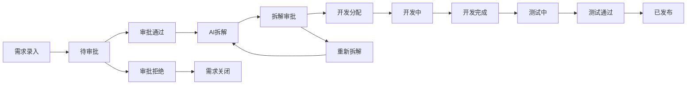

**跟踪功能**:
- **实时状态**: 需求当前状态实时更新
- **进度可视化**: 甘特图显示需求进度
- **里程碑管理**: 关键节点里程碑跟踪
- **延期预警**: 超期风险自动预警
- **变更记录**: 完整的需求变更历史

## 4. 开发管理模块详细设计

### 4.1 任务分配子模块

#### **4.1.1 开发任务分配界面**

**界面布局**:
```
┌─────────────────────────────────────────────────────────────────┐
│ 开发任务分配                              📊 负载分析 ⚙️ 设置   │
├─────────────────────────────────────────────────────────────────┤
│ 待分配需求 (8)                                                  │
│ ┌─────────────────────────────────────────────────────────────┐ │
│ │ 📋 用户登录优化需求 (已拆解)                    🔴 高优先级  │ │
│ │ 功能点: 3个 | 预估工作量: 15人天 | 技术栈: React + Node.js  │ │
│ │ ─────────────────────────────────────────────────────────── │ │
│ │ 开发方式选择:                                               │ │
│ │ ○ 手动开发  ● AI辅助开发  ○ 混合开发                       │ │
│ │                                                             │ │
│ │ 开发人员分配:                                               │ │
│ │ ┌─────────────┐ ┌─────────────┐ ┌─────────────┐           │ │
│ │ │ 张开发 (60%) │ │ 李前端 (40%) │ │ 王后端 (30%) │           │ │
│ │ │ React专家   │ │ UI/UX专家   │ │ Node.js专家 │           │ │
│ │ │ ✅ 推荐     │ │ ⚠️ 负载高   │ │ ✅ 可用     │           │ │
│ │ └─────────────┘ └─────────────┘ └─────────────┘           │ │
│ │                                                             │ │
│ │ AI Agent选择 (AI辅助开发):                                  │ │
│ │ [Claude Code] [Cursor AI] [GitHub Copilot] [Augment Code]  │ │
│ │                                                             │ │
│ │ ┌─────────┐ ┌─────────┐ ┌─────────┐                       │ │
│ │ │ 智能推荐 │ │ 手动分配 │ │ 批量分配 │                       │ │
│ │ └─────────┘ └─────────┘ └─────────┘                       │ │
│ └─────────────────────────────────────────────────────────────┘ │
└─────────────────────────────────────────────────────────────────┘
```

**智能分配算法**:
- **技能匹配**: 根据开发人员技能和需求技术栈匹配
- **负载均衡**: 考虑当前工作负载和可用时间
- **历史表现**: 基于历史项目表现评估
- **协作关系**: 考虑团队协作效果
- **学习成长**: 为开发人员提供技能提升机会

#### **4.1.2 工作负载监控**

**负载可视化**:
```
开发人员工作负载分析
┌─────────────────────────────────────────────────────────┐
│ 张开发  ████████████░░░░ 60%  [React专家]              │
│ 李前端  ████████████████░ 80%  [UI/UX专家] ⚠️ 负载高   │
│ 王后端  ██████░░░░░░░░░░ 30%  [Node.js专家]            │
│ 陈全栈  ██████████░░░░░░ 50%  [全栈开发]               │
│ 刘测试  ████░░░░░░░░░░░░ 20%  [自动化测试]             │
└─────────────────────────────────────────────────────────┘

技能匹配度分析
┌─────────────────────────────────────────────────────────┐
│ 需求: 用户登录优化 (React + Node.js)                    │
│ ─────────────────────────────────────────────────────── │
│ 张开发: ████████████████████ 95% 匹配 ✅ 强烈推荐      │
│ 李前端: ████████████░░░░░░░░ 60% 匹配 ⚠️ 部分匹配      │
│ 王后端: ██████████████░░░░░░ 70% 匹配 ✅ 推荐          │
│ 陈全栈: ████████████████░░░░ 80% 匹配 ✅ 推荐          │
└─────────────────────────────────────────────────────────┘
```

### 4.2 多AI Agent集成子模块

#### **4.2.1 AI Agent选择界面**

**界面布局**:
```
┌─────────────────────────────────────────────────────────────────┐
│ AI开发助手选择                            🤖 AI管理 📊 性能对比 │
├─────────────────────────────────────────────────────────────────┤
│ 当前任务: 用户登录优化需求 - 登录方式优化功能                   │
├─────────────────────────────────────────────────────────────────┤
│ 可用AI Agent                                                   │
│ ┌─────────────────────────────────────────────────────────────┐ │
│ │ 🟢 Claude Code                                   推荐指数: ⭐⭐⭐⭐⭐ │ │
│ │ 特长: 代码生成、逻辑优化、注释生成                           │ │
│ │ 适用: React组件开发、业务逻辑实现                           │ │
│ │ 性能: 生成速度快、代码质量高、语法准确率95%                  │ │
│ │ 状态: 🟢 在线 | 响应时间: 1.2s | 今日使用: 23次             │ │
│ │ ┌─────────┐ ┌─────────┐ ┌─────────┐                       │ │
│ │ │ ✅ 选择  │ │ 📊 详情  │ │ ⚙️ 配置  │                       │ │
│ │ └─────────┘ └─────────┘ └─────────┘                       │ │
│ └─────────────────────────────────────────────────────────────┘ │
│ ┌─────────────────────────────────────────────────────────────┐ │
│ │ 🟢 Cursor AI                                 推荐指数: ⭐⭐⭐⭐ │ │
│ │ 特长: 智能补全、重构建议、错误修复                           │ │
│ │ 适用: 代码编辑、实时补全、代码优化                           │ │
│ │ 性能: 补全准确、响应迅速、上下文理解强                       │ │
│ │ 状态: 🟢 在线 | 响应时间: 0.8s | 今日使用: 45次             │ │
│ │ ┌─────────┐ ┌─────────┐ ┌─────────┐                       │ │
│ │ │ ✅ 选择  │ │ 📊 详情  │ │ ⚙️ 配置  │                       │ │
│ │ └─────────┘ └─────────┘ └─────────┘                       │ │
│ └─────────────────────────────────────────────────────────────┘ │
│ ┌─────────────────────────────────────────────────────────────┐ │
│ │ 🔴 GitHub Copilot                        推荐指数: ⭐⭐⭐ │ │
│ │ 特长: 代码建议、模式识别、多语言支持                         │ │
│ │ 适用: 通用代码生成、API调用、数据处理                       │ │
│ │ 性能: 建议丰富、学习能力强、社区支持好                       │ │
│ │ 状态: 🔴 离线 | 最后在线: 2小时前 | 今日使用: 12次           │ │
│ │ ┌─────────┐ ┌─────────┐ ┌─────────┐                       │ │
│ │ │ ❌ 离线  │ │ 📊 详情  │ │ ⚙️ 配置  │                       │ │
│ │ └─────────┘ └─────────┘ └─────────┘                       │ │
│ └─────────────────────────────────────────────────────────────┘ │
│                                                                 │
│ 协同模式                                                        │
│ ○ 单一Agent  ● 多Agent协作  ○ 智能切换                         │
│                                                                 │
│ ┌─────────────┐ ┌─────────────┐ ┌─────────────┐               │
│ │ 开始AI开发   │ │ 性能对比     │ │ Agent管理    │               │
│ └─────────────┘ └─────────────┘ └─────────────┘               │
└─────────────────────────────────────────────────────────────────┘
```

**AI Agent管理功能**:
- **性能监控**: 实时监控各AI Agent的性能指标
- **使用统计**: 统计使用频率和效果评估
- **智能推荐**: 基于任务类型推荐最适合的AI Agent
- **负载均衡**: 在多个AI Agent间分配请求负载
- **版本管理**: 管理AI Agent的版本和更新

### 4.3 AI代码生成子模块

#### **4.3.1 代码生成工作台**

**界面布局**:
```
┌─────────────────────────────────────────────────────────────────┐
│ AI代码生成工作台                          🤖 Claude Code v2.1.0 │
├─────────────────────────────────────────────────────────────────┤
│ 当前任务: 登录方式优化 - 手机号登录功能                         │
├─────────────────────────────────────────────────────────────────┤
│ 需求描述                                                        │
│ ┌─────────────────────────────────────────────────────────────┐ │
│ │ 实现手机号登录功能，包括：                                   │ │
│ │ 1. 手机号格式验证                                           │ │
│ │ 2. 短信验证码发送                                           │ │
│ │ 3. 验证码校验                                               │ │
│ │ 4. 登录状态管理                                             │ │
│ │ 5. 错误处理和用户提示                                       │ │
│ │                                                             │ │
│ │ 技术要求: React + TypeScript + Ant Design                  │ │
│ └─────────────────────────────────────────────────────────────┘ │
│                                                                 │
│ AI生成配置                                                      │
│ ┌─────────────────────────────────────────────────────────────┐ │
│ │ 代码风格: [Google Style] 语言: [TypeScript]                 │ │
│ │ 框架: [React 18] UI库: [Ant Design 5]                      │ │
│ │ 测试: [Jest + RTL] 文档: [JSDoc]                           │ │
│ │ ☑️ 生成注释  ☑️ 生成测试  ☑️ 错误处理  ☑️ 类型定义         │ │
│ └─────────────────────────────────────────────────────────────┘ │
│                                                                 │
│ ┌─────────────┐ ┌─────────────┐ ┌─────────────┐               │
│ │ 🚀 开始生成  │ │ 📋 使用模板  │ │ 🔄 重新生成  │               │
│ └─────────────┘ └─────────────┘ └─────────────┘               │
├─────────────────────────────────────────────────────────────────┤
│ 生成进度                                                        │
│ ┌─────────────────────────────────────────────────────────────┐ │
│ │ 🤖 正在分析需求... ████████████████████████ 100%            │ │
│ │ 📝 正在生成组件... ████████████████░░░░░░░░ 70%             │ │
│ │ 🧪 正在生成测试... ████████░░░░░░░░░░░░░░░░ 40%             │ │
│ │ 📚 正在生成文档... ░░░░░░░░░░░░░░░░░░░░░░░░ 0%              │ │
│ │                                                             │ │
│ │ 预计完成时间: 45秒                                          │ │
│ └─────────────────────────────────────────────────────────────┘ │
└─────────────────────────────────────────────────────────────────┘
```

#### **4.3.2 代码生成结果展示**

**界面布局**:
```
┌─────────────────────────────────────────────────────────────────┐
│ 生成结果                                  📊 质量评分: 92/100   │
├─────────────────────────────────────────────────────────────────┤
│ 文件列表 (6个文件)                                              │
│ ┌─────────────────────────────────────────────────────────────┐ │
│ │ 📁 src/components/Login/                                    │ │
│ │   📄 PhoneLogin.tsx (主组件)                               │ │
│ │   📄 PhoneLogin.types.ts (类型定义)                        │ │
│ │   📄 PhoneLogin.styles.ts (样式文件)                       │ │
│ │   📄 PhoneLogin.test.tsx (测试文件)                        │ │
│ │   📄 index.ts (导出文件)                                   │ │
│ │   📄 README.md (组件文档)                                  │ │
│ └─────────────────────────────────────────────────────────────┘ │
│                                                                 │
│ 代码预览                                                        │
│ ┌─────────────────────────────────────────────────────────────┐ │
│ │ // PhoneLogin.tsx                                           │ │
│ │ import React, { useState } from 'react';                    │ │
│ │ import { Form, Input, Button, message } from 'antd';        │ │
│ │ import { PhoneLoginProps } from './PhoneLogin.types';       │ │
│ │                                                             │ │
│ │ const PhoneLogin: React.FC<PhoneLoginProps> = ({           │ │
│ │   onLogin,                                                  │ │
│ │   loading = false                                           │ │
│ │ }) => {                                                     │ │
│ │   const [form] = Form.useForm();                            │ │
│ │   const [countdown, setCountdown] = useState(0);            │ │
│ │                                                             │ │
│ │   // 手机号验证规则                                          │ │
│ │   const phoneRules = [                                      │ │
│ │     { required: true, message: '请输入手机号' },            │ │
│ │     { pattern: /^1[3-9]\d{9}$/, message: '手机号格式错误' } │ │
│ │   ];                                                        │ │
│ │   ...                                                       │ │
│ └─────────────────────────────────────────────────────────────┘ │
│                                                                 │
│ 质量分析                                                        │
│ ┌─────────────────────────────────────────────────────────────┐ │
│ │ ✅ 语法检查: 通过 (100%)                                    │ │
│ │ ✅ 类型检查: 通过 (98%)                                     │ │
│ │ ✅ 代码规范: 通过 (95%)                                     │ │
│ │ ✅ 安全检查: 通过 (90%)                                     │ │
│ │ ⚠️ 性能优化: 建议优化 (85%)                                 │ │
│ │ ✅ 测试覆盖: 通过 (88%)                                     │ │
│ │                                                             │ │
│ │ 建议: 可以使用useMemo优化重复计算                           │ │
│ └─────────────────────────────────────────────────────────────┘ │
│                                                                 │
│ ┌─────────────┐ ┌─────────────┐ ┌─────────────┐               │
│ │ 💾 保存代码  │ │ 📤 提交审查  │ │ 🔄 重新生成  │               │
│ └─────────────┘ └─────────────┘ └─────────────┘               │
└─────────────────────────────────────────────────────────────────┘
```

## 5. 代码管理模块详细设计

### 5.1 Git仓库集成子模块

#### **5.1.1 仓库管理界面**

**界面布局**:
```
┌─────────────────────────────────────────────────────────────────┐
│ Git仓库管理                               🔗 连接状态 ⚙️ 设置   │
├─────────────────────────────────────────────────────────────────┤
│ 已连接仓库 (4个)                                                │
│ ┌─────────────────────────────────────────────────────────────┐ │
│ │ 🟢 ai-dev-platform (主仓库)                                │ │
│ │ 类型: 内置Git | 分支: 15个 | 提交: 1,234个                  │ │
│ │ 最后同步: 2分钟前 | 状态: 🟢 正常                           │ │
│ │ ┌─────────┐ ┌─────────┐ ┌─────────┐ ┌─────────┐           │ │
│ │ │ 📊 统计  │ │ 🌿 分支  │ │ 📝 提交  │ │ ⚙️ 设置  │           │ │
│ │ └─────────┘ └─────────┘ └─────────┘ └─────────┘           │ │
│ └─────────────────────────────────────────────────────────────┘ │
│ ┌─────────────────────────────────────────────────────────────┐ │
│ │ 🟢 GitHub: company/frontend                                 │ │
│ │ 类型: GitHub | 分支: 8个 | 提交: 567个                      │ │
│ │ 最后同步: 5分钟前 | 状态: 🟢 正常                           │ │
│ │ ┌─────────┐ ┌─────────┐ ┌─────────┐ ┌─────────┐           │ │
│ │ │ 📊 统计  │ │ 🌿 分支  │ │ 📝 提交  │ │ ⚙️ 设置  │           │ │
│ │ └─────────┘ └─────────┘ └─────────┘ └─────────┘           │ │
│ └─────────────────────────────────────────────────────────────┘ │
│ ┌─────────────────────────────────────────────────────────────┐ │
│ │ 🟡 GitLab: internal/backend                                 │ │
│ │ 类型: GitLab | 分支: 12个 | 提交: 890个                     │ │
│ │ 最后同步: 1小时前 | 状态: 🟡 同步延迟                       │ │
│ │ ┌─────────┐ ┌─────────┐ ┌─────────┐ ┌─────────┐           │ │
│ │ │ 📊 统计  │ │ 🌿 分支  │ │ 📝 提交  │ │ ⚙️ 设置  │           │ │
│ │ └─────────┘ └─────────┘ └─────────┘ └─────────┘           │ │
│ └─────────────────────────────────────────────────────────────┘ │
│                                                                 │
│ ┌─────────────┐ ┌─────────────┐ ┌─────────────┐               │
│ │ ➕ 添加仓库  │ │ 🔄 同步全部  │ │ 📊 全局统计  │               │
│ └─────────────┘ └─────────────┘ └─────────────┘               │
└─────────────────────────────────────────────────────────────────┘
```

**仓库集成功能**:
- **多平台支持**: GitHub、GitLab、Gitee、内置Git
- **自动同步**: 定时同步代码和分支信息
- **权限管理**: 细粒度的仓库访问权限控制
- **分支策略**: 支持GitFlow、GitHub Flow等分支策略
- **Webhook集成**: 自动接收仓库事件通知

### 5.2 代码审查子模块

#### **5.2.1 代码审查工作台**

**界面布局**:
```
┌─────────────────────────────────────────────────────────────────┐
│ 代码审查工作台                            🤖 AI助手 📊 统计     │
├─────────────────────────────────────────────────────────────────┤
│ 待审查 (5) │ 审查中 (3) │ 已通过 (12) │ 需修改 (2)            │
├─────────────────────────────────────────────────────────────────┤
│ Pull Request: feat/phone-login-optimization                     │
│ ┌─────────────────────────────────────────────────────────────┐ │
│ │ 📋 手机号登录功能实现                           🔴 高优先级  │ │
│ │ 作者: 张开发 | 目标分支: main | 创建时间: 2小时前            │ │
│ │ 文件变更: +245 -12 | 涉及文件: 6个                          │ │
│ │ ─────────────────────────────────────────────────────────── │ │
│ │ AI分析结果:                                                 │ │
│ │ ✅ 代码规范: 95% 通过                                       │ │
│ │ ✅ 安全检查: 无安全问题                                     │ │
│ │ ⚠️ 性能问题: 发现1个潜在性能问题                            │ │
│ │ ✅ 测试覆盖: 88% 覆盖率                                     │ │
│ │                                                             │ │
│ │ 主要变更:                                                   │ │
│ │ • 新增PhoneLogin组件                                       │ │
│ │ • 添加手机号验证逻辑                                        │ │
│ │ • 集成短信验证码服务                                        │ │
│ │ • 完善错误处理机制                                          │ │
│ │                                                             │ │
│ │ ┌─────────┐ ┌─────────┐ ┌─────────┐ ┌─────────┐           │ │
│ │ │ 📝 审查  │ │ 🤖 AI分析│ │ ✅ 通过  │ │ ❌ 拒绝  │           │ │
│ │ └─────────┘ └─────────┘ └─────────┘ └─────────┘           │ │
│ └─────────────────────────────────────────────────────────────┘ │
└─────────────────────────────────────────────────────────────────┘
```

#### **5.2.2 代码审查详情页**

**界面布局**:
```
┌─────────────────────────────────────────────────────────────────┐
│ 代码审查详情                              🤖 AI建议 💬 评论     │
├─────────────────────────────────────────────────────────────────┤
│ 文件: src/components/Login/PhoneLogin.tsx                      │
├─────────────────────────────────────────────────────────────────┤
│ 1  import React, { useState, useCallback } from 'react';        │
│ 2  import { Form, Input, Button, message } from 'antd';         │
│ 3  import { PhoneLoginProps } from './PhoneLogin.types';        │
│ 4                                                               │
│ 5+ const PhoneLogin: React.FC<PhoneLoginProps> = ({            │
│ 6+   onLogin,                                                   │
│ 7+   loading = false                                            │
│ 8+ }) => {                                                      │
│ 9+   const [form] = Form.useForm();                             │
│10+   const [countdown, setCountdown] = useState(0);             │ │
│11                                                               │
│12+   // 发送验证码                                              │ │
│13+   const sendCode = async (phone: string) => {               │ │
│14+     try {                                                    │ │
│15+       await fetch('/api/sms/send', {          🤖 AI建议      │ │
│16+         method: 'POST',                       ┌─────────────┐ │
│17+         body: JSON.stringify({ phone })       │ 建议使用     │ │
│18+       });                                     │ axios或封装  │ │
│19+       setCountdown(60);                       │ 的API客户端  │ │
│20+     } catch (error) {                         └─────────────┘ │
│21+       message.error('发送失败');                              │ │
│22+     }                                                        │ │
│23+   };                                                         │ │
│24                                                               │
│25+   return (                                                   │ │
│26+     <Form form={form} onFinish={onLogin}>                    │ │
│27+       <Form.Item name="phone" rules={phoneRules}>            │ │
│28+         <Input placeholder="请输入手机号" />                  │ │
│29+       </Form.Item>                                           │ │
│30+       <Button onClick={() => sendCode(form.getFieldValue('phone'))}>│
│31+         发送验证码 {countdown > 0 && `(${countdown}s)`}       │ │
│32+       </Button>                                              │ │
│33+     </Form>                                                  │ │
│34+   );                                                         │ │
│35+ };                                                           │ │
├─────────────────────────────────────────────────────────────────┤
│ 审查意见                                                        │
│ ┌─────────────────────────────────────────────────────────────┐ │
│ │ 💬 李审查员 (2小时前)                                       │ │
│ │ 第15-18行: 建议使用统一的API客户端，而不是直接使用fetch      │ │
│ │ 第30行: 需要添加手机号格式验证                              │ │
│ │ 整体代码质量不错，逻辑清晰，建议修改后合并                   │ │
│ │ ┌─────────┐ ┌─────────┐                                   │ │
│ │ │ 👍 赞同  │ │ 💬 回复  │                                   │ │
│ │ └─────────┘ └─────────┘                                   │ │
│ └─────────────────────────────────────────────────────────────┘ │
│ ┌─────────────────────────────────────────────────────────────┐ │
│ │ 🤖 AI助手建议                                               │ │
│ │ 1. 第15行: 建议使用try-catch包装API调用                     │ │
│ │ 2. 第19行: 倒计时逻辑可以提取为自定义Hook                   │ │
│ │ 3. 第30行: 建议添加防抖处理，避免重复点击                   │ │
│ │ 4. 性能优化: 使用useCallback包装事件处理函数                │ │
│ │ ┌─────────┐ ┌─────────┐                                   │ │
│ │ │ ✅ 采纳  │ │ ❌ 忽略  │                                   │ │
│ │ └─────────┘ └─────────┘                                   │ │
│ └─────────────────────────────────────────────────────────────┘ │
│                                                                 │
│ ┌─────────────┐ ┌─────────────┐ ┌─────────────┐               │
│ │ 💬 添加评论  │ │ ✅ 批准合并  │ │ 🔄 请求修改  │               │ │
│ └─────────────┘ └─────────────┘ └─────────────┘               │
└─────────────────────────────────────────────────────────────────┘
```

**AI代码审查功能**:
- **智能分析**: 自动检测代码问题和改进建议
- **安全扫描**: 识别潜在的安全漏洞
- **性能分析**: 检测性能瓶颈和优化机会
- **规范检查**: 验证代码是否符合团队规范
- **测试覆盖**: 分析测试覆盖率和质量

## 6. 部署管理模块详细设计

### 6.1 CI/CD流水线子模块

#### **6.1.1 流水线配置界面**

**界面布局**:
```
┌─────────────────────────────────────────────────────────────────┐
│ CI/CD流水线配置                           🚀 流水线 📊 统计     │
├─────────────────────────────────────────────────────────────────┤
│ 项目: ai-dev-platform | 分支: main                             │
├─────────────────────────────────────────────────────────────────┤
│ 流水线阶段配置                                                  │
│ ┌─────────────────────────────────────────────────────────────┐ │
│ │ 1️⃣ 代码检出                                                │ │
│ │ ├─ Git Clone                                                │ │
│ │ ├─ 分支: main                                               │ │
│ │ └─ 触发条件: Push/PR                                        │ │
│ │                                                             │ │
│ │ 2️⃣ 代码质量检查                                            │ │
│ │ ├─ ESLint检查                                               │ │
│ │ ├─ TypeScript编译                                           │ │
│ │ ├─ 单元测试                                                 │ │
│ │ └─ 代码覆盖率检查                                           │ │
│ │                                                             │ │
│ │ 3️⃣ 构建阶段                                                │ │
│ │ ├─ 依赖安装 (npm install)                                   │ │
│ │ ├─ 项目构建 (npm run build)                                 │ │
│ │ ├─ Docker镜像构建                                           │ │
│ │ └─ 镜像推送到仓库                                           │ │
│ │                                                             │ │
│ │ 4️⃣ 部署阶段                                                │ │
│ │ ├─ 测试环境部署                                             │ │
│ │ ├─ 健康检查                                                 │ │
│ │ ├─ 自动化测试                                               │ │
│ │ └─ 部署结果通知                                             │ │
│ └─────────────────────────────────────────────────────────────┘ │
│                                                                 │
│ 环境配置                                                        │
│ ┌─────────────────────────────────────────────────────────────┐ │
│ │ 测试环境: test.ai-dev.com                                   │ │
│ │ 预发环境: staging.ai-dev.com                                │ │
│ │ 生产环境: ai-dev.com                                        │ │
│ │                                                             │ │
│ │ 部署策略:                                                   │ │
│ │ ○ 蓝绿部署  ● 滚动更新  ○ 金丝雀发布                       │ │
│ └─────────────────────────────────────────────────────────────┘ │
│                                                                 │
│ ┌─────────────┐ ┌─────────────┐ ┌─────────────┐               │
│ │ 💾 保存配置  │ │ 🚀 立即执行  │ │ 📊 执行历史  │               │
│ └─────────────┘ └─────────────┘ └─────────────┘               │
└─────────────────────────────────────────────────────────────────┘
```

#### **6.1.2 流水线执行监控**

**界面布局**:
```
┌─────────────────────────────────────────────────────────────────┐
│ 流水线执行监控                            ⏱️ 执行中 🔄 刷新    │
├─────────────────────────────────────────────────────────────────┤
│ 执行ID: #1234 | 分支: main | 触发者: 张开发 | 开始时间: 14:30   │
├─────────────────────────────────────────────────────────────────┤
│ 执行进度                                                        │
│ ┌─────────────────────────────────────────────────────────────┐ │
│ │ ✅ 1️⃣ 代码检出          ████████████████████████ 100% 2m30s │ │
│ │ ✅ 2️⃣ 代码质量检查      ████████████████████████ 100% 5m15s │ │
│ │ 🔄 3️⃣ 构建阶段          ████████████████░░░░░░░░ 75%  3m20s │ │
│ │ ⏳ 4️⃣ 部署阶段          ░░░░░░░░░░░░░░░░░░░░░░░░ 0%   等待中  │ │
│ │                                                             │ │
│ │ 总进度: ████████████████░░░░░░░░ 62% | 预计剩余: 4分钟      │ │
│ └─────────────────────────────────────────────────────────────┘ │
│                                                                 │
│ 实时日志                                                        │
│ ┌─────────────────────────────────────────────────────────────┐ │
│ │ [14:35:20] 开始构建Docker镜像...                            │ │
│ │ [14:35:25] Step 1/8 : FROM node:18-alpine                  │ │
│ │ [14:35:26] ---> 7d4e6b5c8a9f                               │ │
│ │ [14:35:26] Step 2/8 : WORKDIR /app                         │ │
│ │ [14:35:27] ---> Running in 2f3a4b5c6d7e                   │ │
│ │ [14:35:28] ---> 8e9f0a1b2c3d                               │ │
│ │ [14:35:28] Step 3/8 : COPY package*.json ./               │ │
│ │ [14:35:30] ---> 4f5g6h7i8j9k                               │ │
│ │ [14:35:30] Step 4/8 : RUN npm ci --only=production        │ │
│ │ [14:35:45] npm WARN deprecated package@1.0.0               │ │
│ │ [14:35:50] added 1247 packages in 20s                     │ │
│ │ [14:35:51] ---> 1a2b3c4d5e6f                               │ │
│ │ [14:35:51] 正在构建应用...                                  │ │
│ │ ▼ 展开全部日志                                              │ │
│ └─────────────────────────────────────────────────────────────┘ │
│                                                                 │
│ 质量检查结果                                                    │
│ ┌─────────────────────────────────────────────────────────────┐ │
│ │ ✅ ESLint: 0 errors, 2 warnings                            │ │
│ │ ✅ TypeScript: 编译成功                                     │ │
│ │ ✅ 单元测试: 45/45 passed (100%)                           │ │
│ │ ✅ 代码覆盖率: 88.5% (>80% 要求)                           │ │
│ │ ⚠️ 安全扫描: 发现1个低风险漏洞                              │ │
│ └─────────────────────────────────────────────────────────────┘ │
│                                                                 │
│ ┌─────────────┐ ┌─────────────┐ ┌─────────────┐               │
│ │ ⏸️ 暂停执行  │ │ ❌ 取消执行  │ │ 📋 查看详情  │               │
│ └─────────────┘ └─────────────┘ └─────────────┘               │
└─────────────────────────────────────────────────────────────────┘
```

### 6.2 发布策略子模块

#### **6.2.1 发布策略选择界面**

**界面布局**:
```
┌─────────────────────────────────────────────────────────────────┐
│ 发布策略配置                              🚀 发布 📊 监控       │
├─────────────────────────────────────────────────────────────────┤
│ 应用: ai-dev-platform | 版本: v2.1.0 | 环境: 生产环境         │
├─────────────────────────────────────────────────────────────────┤
│ 发布策略选择                                                    │
│ ┌─────────────────────────────────────────────────────────────┐ │
│ │ ○ 完整发布 (Full Deployment)                               │ │
│ │   一次性替换所有实例，发布速度快但风险较高                   │ │
│ │   适用场景: 小规模应用、维护窗口发布                         │ │
│ │   风险等级: 🔴 高                                           │ │
│ │                                                             │ │
│ │ ● 灰度发布 (Canary Deployment)                             │ │
│ │   逐步增加新版本流量比例，可控制发布风险                     │ │
│ │   适用场景: 大规模应用、用户敏感功能                         │ │
│ │   风险等级: 🟡 中                                           │ │
│ │                                                             │ │
│ │ ○ 金丝雀发布 (Blue-Green Deployment)                       │ │
│ │   维护两套完整环境，快速切换和回滚                           │ │
│ │   适用场景: 关键业务、零停机要求                             │ │
│ │   风险等级: 🟢 低                                           │ │
│ └─────────────────────────────────────────────────────────────┘ │
│                                                                 │
│ 灰度发布配置                                                    │
│ ┌─────────────────────────────────────────────────────────────┐ │
│ │ 流量分配策略:                                               │ │
│ │ 阶段1: 5%  新版本 ████░░░░░░░░░░░░░░░░░░░░ 95% 旧版本       │ │
│ │ 阶段2: 20% 新版本 ████████░░░░░░░░░░░░░░░░ 80% 旧版本       │ │
│ │ 阶段3: 50% 新版本 ████████████████░░░░░░░░ 50% 旧版本       │ │
│ │ 阶段4: 100% 新版本 ████████████████████████ 0% 旧版本       │ │
│ │                                                             │ │
│ │ 每阶段持续时间: [30分钟] ⏱️                                 │ │
│ │ 自动推进条件: 错误率 < 1%, 响应时间 < 500ms                 │ │
│ │ 回滚条件: 错误率 > 5%, 响应时间 > 2s                        │ │
│ │                                                             │ │
│ │ 目标用户群体:                                               │ │
│ │ ☑️ 内部用户  ☑️ Beta用户  ○ 地区限制  ○ 用户标签           │ │
│ └─────────────────────────────────────────────────────────────┘ │
│                                                                 │
│ 监控指标                                                        │
│ ┌─────────────────────────────────────────────────────────────┐ │
│ │ 关键指标监控:                                               │ │
│ │ • 错误率: 当前 0.2% | 阈值 < 1%                            │ │
│ │ • 响应时间: 当前 245ms | 阈值 < 500ms                      │ │
│ │ • CPU使用率: 当前 45% | 阈值 < 80%                         │ │
│ │ • 内存使用率: 当前 60% | 阈值 < 85%                        │ │
│ │ • 用户满意度: 当前 4.8/5.0 | 阈值 > 4.0                   │ │
│ └─────────────────────────────────────────────────────────────┘ │
│                                                                 │
│ ┌─────────────┐ ┌─────────────┐ ┌─────────────┐               │
│ │ 🚀 开始发布  │ │ 📋 发布计划  │ │ 📊 历史记录  │               │
│ └─────────────┘ └─────────────┘ └─────────────┘               │
└─────────────────────────────────────────────────────────────────┘
```

### 6.3 发布审批子模块

#### **6.3.1 发布审批工作台**

**界面布局**:
```
┌─────────────────────────────────────────────────────────────────┐
│ 发布审批工作台                            📋 待审批 📊 统计     │
├─────────────────────────────────────────────────────────────────┤
│ 待审批 (3) │ 已审批 (15) │ 已拒绝 (1) │ 已发布 (12)          │
├─────────────────────────────────────────────────────────────────┤
│ 发布申请详情                                                    │
│ ┌─────────────────────────────────────────────────────────────┐ │
│ │ 🚀 ai-dev-platform v2.1.0 生产环境发布                     │ │
│ │ 申请人: 张开发 | 申请时间: 1小时前 | 优先级: 🔴 高           │ │
│ │ ─────────────────────────────────────────────────────────── │ │
│ │ 发布内容:                                                   │ │
│ │ • 新增手机号登录功能                                        │ │
│ │ • 优化用户体验                                              │ │
│ │ • 修复已知Bug 3个                                           │ │
│ │ • 性能优化                                                  │ │
│ │                                                             │ │
│ │ 技术信息:                                                   │ │
│ │ • 代码变更: +1,245 -567 行                                 │ │
│ │ • 测试覆盖率: 88.5%                                        │ │
│ │ • 性能测试: 通过                                            │ │
│ │ • 安全扫描: 无高危漏洞                                      │ │
│ │                                                             │ │
│ │ 发布策略: 灰度发布 (5% → 20% → 50% → 100%)                 │ │
│ │ 预计影响: 10万用户                                          │ │
│ │ 回滚方案: 自动回滚 + 手动回滚                               │ │
│ │                                                             │ │
│ │ 风险评估:                                                   │ │
│ │ ✅ 代码质量: 优秀                                           │ │
│ │ ✅ 测试完整性: 充分                                         │ │
│ │ ⚠️ 业务影响: 中等 (新功能可能影响现有流程)                  │ │
│ │ ✅ 技术风险: 低                                             │ │
│ │                                                             │ │
│ │ ┌─────────┐ ┌─────────┐ ┌─────────┐ ┌─────────┐           │ │
│ │ │ ✅ 批准  │ │ ❌ 拒绝  │ │ 📋 详情  │ │ 💬 评论  │           │ │
│ │ └─────────┘ └─────────┘ └─────────┘ └─────────┘           │ │
│ └─────────────────────────────────────────────────────────────┘ │
└─────────────────────────────────────────────────────────────────┘
```

**审批功能特性**:
- **多级审批**: 支持技术负责人、运维负责人多级审批
- **风险评估**: 自动评估发布风险等级
- **影响分析**: 分析发布对用户和业务的影响
- **审批记录**: 完整的审批历史和决策记录
- **紧急发布**: 支持紧急情况下的快速审批流程

---

**文档完成时间**: 2025-01-21
**文档状态**: v2.0 - 根据用户故事全面重构完成
**下一步**: 更新功能清单表格和调整原型设计

#### **3.1.2 功能组件详细设计**

**今日任务组件**
- **数据源**: 项目管理系统、任务分配AI
- **显示内容**: 
  - 任务标题、优先级、截止时间
  - 任务进度条和完成状态
  - 关联项目和负责人信息
- **交互功能**:
  - 任务状态快速更新
  - 一键启动AI代码助手
  - 任务详情查看和编辑

**AI助手状态组件**
- **数据源**: AI插件管理系统
- **显示内容**:
  - 当前可用的AI插件列表
  - 各插件的响应时间和可用性
  - 今日使用次数和剩余配额
- **交互功能**:
  - 快速切换AI助手
  - 插件配置快捷入口
  - 使用历史查看

**项目进度组件**
- **数据源**: 项目管理模块
- **显示内容**:
  - 参与项目的整体进度
  - 关键里程碑和截止日期
  - 个人在项目中的贡献度
- **交互功能**:
  - 项目详情快速跳转
  - 进度更新和汇报
  - 风险预警查看

### 3.2 团队协作

#### **3.2.1 团队看板设计**

**Scrum看板布局**
```
┌─────────────┬─────────────┬─────────────┬─────────────┐
│   待办事项   │   进行中     │   代码审查   │   已完成     │
│  (Backlog)  │ (In Progress)│ (Code Review)│   (Done)    │
├─────────────┼─────────────┼─────────────┼─────────────┤
│ 📋 需求A     │ 👨‍💻 功能B    │ 🔍 模块C     │ ✅ 任务D     │
│ 📋 需求E     │ 👨‍💻 功能F    │ 🔍 模块G     │ ✅ 任务H     │
│ 📋 需求I     │ 👨‍💻 功能J    │              │ ✅ 任务K     │
└─────────────┴─────────────┴─────────────┴─────────────┘
```

**AI增强功能**
- **智能任务分配**: AI根据团队成员技能和工作负载自动推荐任务分配
- **进度预测**: 基于历史数据预测任务完成时间
- **瓶颈识别**: 自动识别流程中的瓶颈环节
- **质量监控**: 实时监控代码质量和测试覆盖率

#### **3.2.2 实时协作功能**

**在线协作编辑**
- **多人同时编辑**: 支持多人同时编辑同一文档或代码
- **实时同步**: 变更实时同步到所有协作者
- **冲突解决**: 智能冲突检测和解决建议
- **版本历史**: 完整的编辑历史和回滚功能

**团队沟通集成**
- **内置聊天**: 项目内置聊天功能
- **语音/视频会议**: 集成会议功能
- **屏幕共享**: 代码和设计共享
- **AI会议助手**: 自动生成会议纪要和行动项

### 3.3 快速入口

#### **3.3.1 智能快捷操作**

**AI驱动的快捷操作**
- **智能建议**: 基于用户行为模式推荐常用操作
- **语音命令**: 支持语音快速启动功能
- **快捷键定制**: 个性化快捷键设置
- **上下文感知**: 根据当前工作内容提供相关操作

**常用操作列表**
```
🚀 快速开始
├── 📝 创建新需求
├── 💻 启动AI代码生成
├── 🔍 代码质量检查
├── 🧪 运行测试套件
├── 🚀 一键部署
└── 📊 生成项目报告

🔧 开发工具
├── 🎯 AI任务分配
├── 📋 代码模板库
├── 🔄 Git操作面板
├── 🐳 Docker管理
├── ☸️ K8s集群状态
└── 📈 性能监控

⚙️ 个人设置
├── 🎨 界面主题
├── 🔔 通知偏好
├── 🤖 AI助手配置
├── 🔑 API密钥管理
├── 📱 移动端同步
└── 🌐 语言设置
```

#### **3.3.2 个性化定制**

**工作台布局定制**
- **拖拽布局**: 支持组件拖拽重新排列
- **组件大小**: 可调整组件显示大小
- **显示/隐藏**: 选择性显示需要的组件
- **主题切换**: 多种主题风格选择

**智能推荐系统**
- **使用习惯分析**: 分析用户操作习惯
- **功能推荐**: 推荐可能需要的功能
- **效率优化**: 提供工作效率优化建议
- **学习路径**: 推荐技能提升路径

## 4. 菜单国际化设计

### 4.1 多语言支持

#### **支持语言列表**
- **中文简体** (zh-CN) - 默认语言
- **中文繁体** (zh-TW)
- **英语** (en-US)
- **日语** (ja-JP)
- **韩语** (ko-KR)
- **德语** (de-DE)
- **法语** (fr-FR)
- **西班牙语** (es-ES)

#### **国际化实现方案**
```typescript
// 菜单国际化配置示例
interface MenuI18nConfig {
  'menu.workspace': {
    'zh-CN': '工作台',
    'en-US': 'Workspace',
    'ja-JP': 'ワークスペース'
  },
  'menu.ai-plugins': {
    'zh-CN': 'AI插件管理',
    'en-US': 'AI Plugin Management',
    'ja-JP': 'AIプラグイン管理'
  },
  'menu.development': {
    'zh-CN': '开发流程',
    'en-US': 'Development Process',
    'ja-JP': '開発プロセス'
  }
}
```

### 4.2 文化适配

#### **界面布局适配**
- **文字方向**: 支持从左到右(LTR)和从右到左(RTL)
- **日期格式**: 根据地区显示不同日期格式
- **数字格式**: 千分位分隔符和小数点适配
- **货币显示**: 支持多种货币符号和格式

#### **功能适配**
- **时区处理**: 自动识别用户时区
- **法规遵循**: 适配不同地区的数据保护法规
- **支付方式**: 支持不同地区的支付方式
- **客服支持**: 多语言客服支持

## 5. 菜单性能优化

### 5.1 加载性能优化

#### **懒加载策略**
- **菜单按需加载**: 只加载当前需要的菜单项
- **组件懒加载**: 大型组件延迟加载
- **数据预取**: 智能预取可能需要的数据
- **缓存策略**: 合理的缓存机制

#### **渲染优化**
- **虚拟滚动**: 大列表虚拟滚动
- **防抖节流**: 搜索和筛选防抖处理
- **批量更新**: DOM批量更新减少重绘
- **内存管理**: 及时清理不需要的组件

### 5.2 用户体验优化

#### **响应速度优化**
- **菜单切换**: < 100ms 响应时间
- **页面加载**: < 2s 首屏加载时间
- **数据更新**: < 500ms 数据刷新时间
- **搜索响应**: < 300ms 搜索结果显示

#### **交互体验优化**
- **加载状态**: 清晰的加载状态指示
- **错误处理**: 友好的错误提示和恢复
- **离线支持**: 关键功能离线可用
- **快捷操作**: 键盘快捷键支持

## 6. AI插件管理模块详细设计

### 6.1 插件市场

#### **6.1.1 插件市场界面设计**

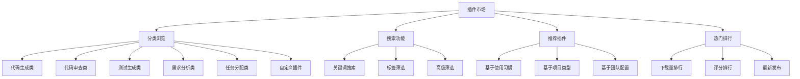

**插件卡片设计**
```
┌─────────────────────────────────────────┐
│ 🤖 Claude Code Assistant               │
│ ⭐⭐⭐⭐⭐ 4.8 (1,234 评价)              │
│                                         │
│ 📝 Anthropic官方代码生成插件             │
│ 🏷️ 代码生成 | 代码优化 | 多语言支持       │
│                                         │
│ 💰 免费 | 📊 10K+ 下载 | 🔄 v2.1.0      │
│                                         │
│ [📥 安装] [👁️ 详情] [⭐ 收藏]           │
└─────────────────────────────────────────┘
```

#### **6.1.2 插件详情页设计**

**详情页布局**
- **插件基本信息**: 名称、版本、开发者、许可证
- **功能介绍**: 详细功能描述、使用场景、特色功能
- **技术规格**: 支持的编程语言、API版本、系统要求
- **安装指南**: 安装步骤、配置说明、快速开始
- **用户评价**: 评分、评论、使用反馈
- **更新日志**: 版本历史、功能更新、Bug修复

**插件兼容性检查**
```typescript
interface PluginCompatibility {
  platformVersion: string;     // 平台版本要求
  dependencies: string[];      // 依赖插件列表
  conflicts: string[];         // 冲突插件列表
  systemRequirements: {
    memory: string;            // 内存要求
    cpu: string;              // CPU要求
    storage: string;          // 存储要求
  };
  supportedLanguages: string[]; // 支持的编程语言
}
```

### 6.2 已安装插件管理

#### **6.2.1 插件列表界面**

**列表视图设计**
```
┌─────────────────────────────────────────────────────────────┐
│ 已安装插件 (8)                    [🔄 检查更新] [⚙️ 批量操作] │
├─────────────────────────────────────────────────────────────┤
│ ✅ Claude Code      v2.1.0  🟢 运行中  [⚙️] [⏸️] [🗑️]      │
│ ✅ Gemini Code      v1.8.2  🟢 运行中  [⚙️] [⏸️] [🗑️]      │
│ ⏸️ Cursor AI        v3.0.1  🟡 已暂停  [⚙️] [▶️] [🗑️]      │
│ ❌ GitHub Copilot   v1.5.0  🔴 异常    [⚙️] [🔧] [🗑️]      │
│ ✅ Augment Code     v2.3.0  🟢 运行中  [⚙️] [⏸️] [🗑️]      │
│ ✅ Custom Plugin    v1.0.0  🟢 运行中  [⚙️] [⏸️] [🗑️]      │
└─────────────────────────────────────────────────────────────┘
```

**状态指示器**
- 🟢 **运行中**: 插件正常工作，可以接收请求
- 🟡 **已暂停**: 插件已暂停，不接收新请求
- 🔴 **异常**: 插件出现错误，需要修复
- 🟠 **更新中**: 插件正在更新
- ⚪ **未配置**: 插件已安装但未完成配置

#### **6.2.2 插件操作功能**

**基本操作**
- **启动/暂停**: 控制插件运行状态
- **重启**: 重新启动异常插件
- **卸载**: 安全卸载插件和清理数据
- **更新**: 检查和安装插件更新
- **配置**: 进入插件配置界面

**批量操作**
- **批量启动/暂停**: 选择多个插件进行操作
- **批量更新**: 一键更新所有可更新插件
- **批量配置**: 统一配置相似插件
- **导出配置**: 导出插件配置用于备份
- **导入配置**: 从备份恢复插件配置

### 6.3 插件配置管理

#### **6.3.1 配置界面设计**

**配置页面布局**
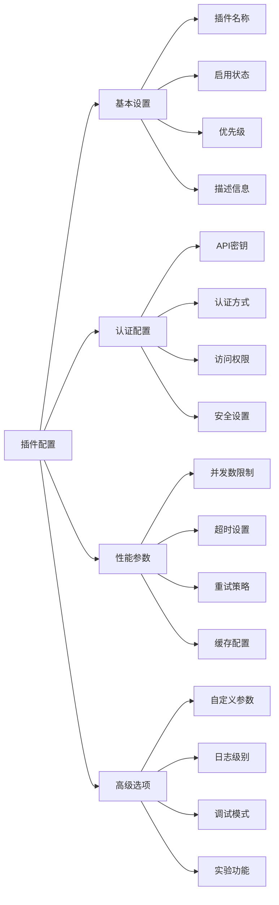

**配置表单示例**
```yaml
# Claude Code插件配置示例
plugin_config:
  basic:
    name: "Claude Code Assistant"
    enabled: true
    priority: 1
    description: "Anthropic Claude代码生成助手"

  authentication:
    api_key: "${CLAUDE_API_KEY}"
    auth_type: "api_key"
    endpoint: "https://api.anthropic.com"

  performance:
    max_concurrent: 10
    timeout: 30000
    retry_count: 3
    cache_ttl: 3600

  advanced:
    model: "claude-3-sonnet-20240229"
    temperature: 0.1
    max_tokens: 4096
    debug_mode: false
    log_level: "INFO"
```

#### **6.3.2 配置验证和测试**

**配置验证功能**
- **格式验证**: 检查配置格式是否正确
- **连接测试**: 测试API连接是否正常
- **权限验证**: 验证API密钥权限
- **性能测试**: 测试响应时间和并发能力

**测试界面设计**
```
┌─────────────────────────────────────────┐
│ 插件配置测试                             │
├─────────────────────────────────────────┤
│ 🔍 连接测试                              │
│ ✅ API连接正常 (响应时间: 245ms)          │
│                                         │
│ 🔑 权限验证                              │
│ ✅ API密钥有效 (剩余配额: 95%)           │
│                                         │
│ ⚡ 性能测试                              │
│ ✅ 并发测试通过 (10/10)                 │
│ ✅ 响应时间正常 (平均: 1.2s)             │
│                                         │
│ [🧪 运行完整测试] [💾 保存配置]          │
└─────────────────────────────────────────┘
```

### 6.4 插件监控和统计

#### **6.4.1 实时监控界面**

**监控仪表板设计**
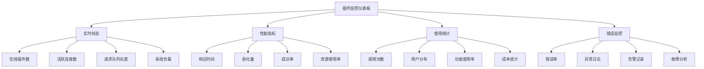

**监控指标卡片**
```
┌─────────────────┬─────────────────┬─────────────────┐
│ 📊 总请求数      │ ⚡ 平均响应时间   │ ✅ 成功率        │
│ 12,345         │ 1.2s           │ 99.2%          │
│ ↗️ +15% (24h)   │ ↘️ -0.3s (24h)  │ ↗️ +0.5% (24h)  │
└─────────────────┴─────────────────┴─────────────────┘

┌─────────────────┬─────────────────┬─────────────────┐
│ 🤖 活跃插件      │ 💰 今日成本      │ 🔥 热门插件      │
│ 6/8            │ $23.45         │ Claude Code    │
│ Claude, Gemini │ ↘️ -$5.20 (昨日) │ 2,341 次调用    │
└─────────────────┴─────────────────┴─────────────────┘
```

#### **6.4.2 性能分析和优化建议**

**性能分析报告**
- **响应时间分析**: 各插件响应时间对比和趋势
- **并发能力分析**: 高峰期并发处理能力评估
- **资源使用分析**: CPU、内存、网络资源使用情况
- **成本效益分析**: 各插件的成本效益比较

**优化建议系统**
```typescript
interface OptimizationSuggestion {
  type: 'performance' | 'cost' | 'reliability';
  priority: 'high' | 'medium' | 'low';
  plugin: string;
  issue: string;
  suggestion: string;
  expectedImprovement: string;
  implementationEffort: string;
}

// 示例优化建议
const suggestions: OptimizationSuggestion[] = [
  {
    type: 'performance',
    priority: 'high',
    plugin: 'Claude Code',
    issue: '响应时间在高峰期显著增加',
    suggestion: '增加并发连接数限制到15',
    expectedImprovement: '响应时间减少30%',
    implementationEffort: '低'
  },
  {
    type: 'cost',
    priority: 'medium',
    plugin: 'Gemini Code',
    issue: '成本较高但使用率不高',
    suggestion: '调整为按需启动模式',
    expectedImprovement: '成本降低40%',
    implementationEffort: '中'
  }
];
```

## 7. 开发流程模块详细设计

### 7.1 需求管理

#### **7.1.1 需求收集界面设计**

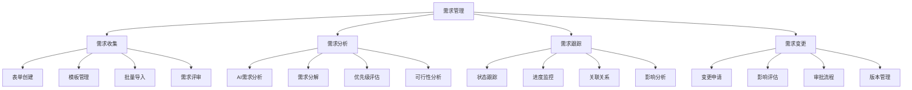

**需求表单设计**
```
┌─────────────────────────────────────────────────────────────┐
│ 📝 新建需求                                    [💾] [🔄] [❌] │
├─────────────────────────────────────────────────────────────┤
│ 需求标题: _________________________________________________ │
│                                                             │
│ 需求类型: [功能需求 ▼] 优先级: [高 ▼] 项目: [项目A ▼]      │
│                                                             │
│ 需求描述:                                                   │
│ ┌─────────────────────────────────────────────────────────┐ │
│ │ 作为一个开发者，我希望能够...                            │ │
│ │                                                         │ │
│ │ [🤖 AI辅助编写] [📋 使用模板] [📎 添加附件]              │ │
│ └─────────────────────────────────────────────────────────┘ │
│                                                             │
│ 验收标准:                                                   │
│ ☑️ 功能正常运行                                             │
│ ☑️ 性能满足要求                                             │
│ ☑️ 通过安全测试                                             │
│ [➕ 添加标准]                                               │
│                                                             │
│ 关联需求: [搜索关联需求...] 标签: #前端 #API #优化          │
│                                                             │
│ [🚀 提交需求] [💾 保存草稿] [👁️ 预览]                      │
└─────────────────────────────────────────────────────────────┘
```

#### **7.1.2 AI需求分析功能**

**智能需求分析**
- **需求完整性检查**: 检查需求描述是否完整、清晰
- **需求冲突检测**: 识别与现有需求的冲突
- **技术可行性评估**: 评估技术实现的可行性和复杂度
- **工作量估算**: 基于历史数据估算开发工作量
- **风险识别**: 识别潜在的技术和业务风险

**分析结果展示**
```
┌─────────────────────────────────────────────────────────────┐
│ 🤖 AI需求分析报告                                           │
├─────────────────────────────────────────────────────────────┤
│ 📊 完整性评分: 85/100                                       │
│ ✅ 需求描述清晰                                             │
│ ⚠️  缺少性能指标要求                                        │
│ ⚠️  验收标准需要更具体                                      │
│                                                             │
│ 🔍 冲突检测: 发现1个潜在冲突                                │
│ ⚠️  与需求#REQ-2023-001在用户权限方面存在冲突               │
│                                                             │
│ ⚡ 技术可行性: 高 (95%)                                     │
│ ✅ 技术栈支持                                               │
│ ✅ 现有架构兼容                                             │
│ ⚠️  需要新增第三方依赖                                      │
│                                                             │
│ 📈 工作量估算: 8-12人天                                     │
│ 前端开发: 3-4人天                                           │
│ 后端开发: 4-6人天                                           │
│ 测试验证: 1-2人天                                           │
│                                                             │
│ ⚠️  风险提示: 2个中等风险                                   │
│ • 第三方API稳定性风险                                       │
│ • 数据迁移复杂度风险                                        │
│                                                             │
│ [📝 查看详细报告] [🔄 重新分析] [✅ 接受分析]               │
└─────────────────────────────────────────────────────────────┘
```

### 7.2 AI代码助手

#### **7.2.1 代码生成界面设计**

**代码生成工作台**
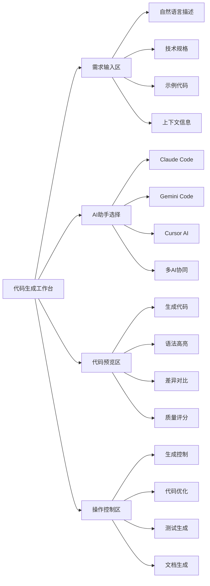

**代码生成界面布局**
```
┌─────────────────────────────────────────────────────────────┐
│ 🤖 AI代码生成助手                          [⚙️] [📊] [❓]    │
├─────────────────────────────────────────────────────────────┤
│ 需求描述:                                                   │
│ ┌─────────────────────────────────────────────────────────┐ │
│ │ 创建一个用户注册API，包含邮箱验证和密码加密功能          │ │
│ │                                                         │ │
│ │ 技术要求:                                               │ │
│ │ - 使用Spring Boot框架                                   │ │
│ │ - 集成Redis缓存                                         │ │
│ │ - 支持JWT认证                                           │ │
│ └─────────────────────────────────────────────────────────┘ │
│                                                             │
│ AI助手选择: [Claude ✓] [Gemini ✓] [Cursor ○] [协同模式 ✓]  │
│                                                             │
│ ┌─────────────────────┬─────────────────────────────────────┐ │
│ │ 📝 生成代码          │ 📊 质量分析                         │ │
│ │                     │                                     │ │
│ │ @RestController     │ 🎯 代码质量: 92/100                 │ │
│ │ public class User   │ ✅ 语法正确                         │ │
│ │ Controller {        │ ✅ 最佳实践                         │ │
│ │   @Autowired        │ ⚠️  异常处理可优化                  │ │
│ │   private UserSer   │                                     │ │
│ │   ...               │ 🔒 安全评分: 88/100                 │ │
│ │                     │ ✅ 输入验证                         │ │
│ │ [📋 复制] [💾 保存]  │ ✅ 密码加密                         │ │
│ │ [🔄 重新生成]       │ ⚠️  需要添加限流                    │ │
│ └─────────────────────┴─────────────────────────────────────┘ │
│                                                             │
│ [🧪 生成测试] [📚 生成文档] [🚀 直接提交] [🔍 代码审查]      │
└─────────────────────────────────────────────────────────────┘
```

#### **7.2.2 多AI协同生成**

**协同生成策略**
- **并行生成**: 多个AI同时生成代码，选择最佳结果
- **分层生成**: 不同AI负责不同层次的代码生成
- **迭代优化**: AI之间相互优化和改进代码
- **投票机制**: 多AI对代码质量进行评分和投票

**协同结果展示**
```
┌─────────────────────────────────────────────────────────────┐
│ 🤖 多AI协同生成结果                                         │
├─────────────────────────────────────────────────────────────┤
│ Claude Code (推荐) ⭐⭐⭐⭐⭐                                │
│ • 代码质量: 95/100                                          │
│ • 安全性: 92/100                                            │
│ • 可维护性: 88/100                                          │
│ • 生成时间: 2.3s                                            │
│                                                             │
│ Gemini Code ⭐⭐⭐⭐                                         │
│ • 代码质量: 89/100                                          │
│ • 安全性: 95/100                                            │
│ • 可维护性: 85/100                                          │
│ • 生成时间: 1.8s                                            │
│                                                             │
│ 融合版本 (AI推荐) ⭐⭐⭐⭐⭐                                │
│ • 结合Claude的代码结构和Gemini的安全特性                    │
│ • 综合评分: 96/100                                          │
│                                                             │
│ [👁️ 查看Claude版本] [👁️ 查看Gemini版本] [✅ 使用融合版本]  │
└─────────────────────────────────────────────────────────────┘
```

### 7.3 代码审查

#### **7.3.1 AI代码审查界面**

**审查工作台设计**
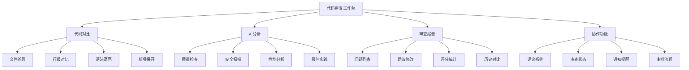

**代码审查界面布局**
```
┌─────────────────────────────────────────────────────────────┐
│ 🔍 代码审查 - PR #123: 用户注册功能实现      [✅] [❌] [💬]  │
├─────────────────────────────────────────────────────────────┤
│ 📊 AI分析结果                                               │
│ 🎯 总体评分: 87/100  🐛 发现问题: 3个  ⚠️  警告: 2个        │
│                                                             │
│ ┌─────────────────────┬─────────────────────────────────────┐ │
│ │ 📝 代码变更          │ 🤖 AI审查意见                       │ │
│ │                     │                                     │ │
│ │ + @PostMapping("/   │ ❌ 高优先级问题                     │ │
│ │ + public Response   │ 第15行: 缺少输入验证                │ │
│ │ + register(@Request │ 建议: 添加@Valid注解验证            │ │
│ │ + Body UserDto dto) │                                     │ │
│ │ + {                 │ ⚠️  中优先级警告                    │ │
│ │ +   User user = new │ 第23行: 异常处理不完整              │ │
│ │ +   User(dto);      │ 建议: 添加具体异常类型              │ │
│ │ +   return userSer  │                                     │ │
│ │ +   vice.save(user) │ ✅ 优点                             │ │
│ │ +   ;               │ • 代码结构清晰                      │ │
│ │ + }                 │ • 命名规范良好                      │ │
│ │                     │ • 遵循RESTful设计                   │ │
│ │ [💬 添加评论]       │                                     │ │
│ └─────────────────────┴─────────────────────────────────────┘ │
│                                                             │
│ 💬 审查评论 (2)                                             │
│ 👤 张三 2小时前: 建议添加日志记录                           │
│ 🤖 AI助手 1小时前: 检测到潜在的SQL注入风险                  │
│                                                             │
│ [✅ 通过审查] [❌ 需要修改] [💬 添加评论] [📊 详细报告]      │
└─────────────────────────────────────────────────────────────┘
```

#### **7.3.2 智能审查规则**

**审查规则配置**
```typescript
interface ReviewRule {
  id: string;
  name: string;
  category: 'security' | 'performance' | 'quality' | 'style';
  severity: 'error' | 'warning' | 'info';
  enabled: boolean;
  aiModel: string[];
  description: string;
  autoFix: boolean;
}

const reviewRules: ReviewRule[] = [
  {
    id: 'security-sql-injection',
    name: 'SQL注入检测',
    category: 'security',
    severity: 'error',
    enabled: true,
    aiModel: ['claude', 'gemini'],
    description: '检测潜在的SQL注入漏洞',
    autoFix: false
  },
  {
    id: 'performance-n-plus-one',
    name: 'N+1查询检测',
    category: 'performance',
    severity: 'warning',
    enabled: true,
    aiModel: ['claude'],
    description: '检测N+1查询问题',
    autoFix: true
  }
];
```

### 7.4 测试管理

#### **7.4.1 AI测试生成**

**测试生成界面**
```
┌─────────────────────────────────────────────────────────────┐
│ 🧪 AI测试生成                              [⚙️] [📊] [❓]    │
├─────────────────────────────────────────────────────────────┤
│ 目标代码: UserController.java                               │
│ 测试类型: [单元测试 ✓] [集成测试 ✓] [性能测试 ○]            │
│ 覆盖率目标: [90% ▼]  测试框架: [JUnit 5 ▼]                 │
│                                                             │
│ 🤖 AI分析结果:                                              │
│ • 识别到5个公共方法需要测试                                 │
│ • 检测到3个边界条件场景                                     │
│ • 发现2个异常处理路径                                       │
│                                                             │
│ ┌─────────────────────┬─────────────────────────────────────┐ │
│ │ 📝 生成的测试代码    │ 📊 测试覆盖分析                     │ │
│ │                     │                                     │ │
│ │ @Test               │ 📈 预期覆盖率: 92%                  │ │
│ │ void testRegister   │ ✅ 正常流程: 5个测试                │ │
│ │ Success() {         │ ⚠️  边界条件: 3个测试               │ │
│ │   // Given          │ ❌ 异常情况: 2个测试                │ │
│ │   UserDto dto = new │                                     │ │
│ │   UserDto("test@    │ 🎯 测试策略:                        │ │
│ │   example.com");    │ • 参数验证测试                      │ │
│ │   // When           │ • 业务逻辑测试                      │ │
│ │   Response result = │ • 异常处理测试                      │ │
│ │   controller.regis  │ • 集成测试                          │ │
│ │   ter(dto);         │                                     │ │
│ │   // Then           │ [📋 复制测试] [💾 保存]             │ │
│ │   assertEquals...   │ [🔄 重新生成]                       │ │
│ └─────────────────────┴─────────────────────────────────────┘ │
│                                                             │
│ [🚀 生成完整测试套件] [🧪 运行测试] [📊 覆盖率报告]          │
└─────────────────────────────────────────────────────────────┘
```

#### **7.4.2 测试执行和报告**

**测试执行界面**
```
┌─────────────────────────────────────────────────────────────┐
│ 🧪 测试执行结果                                             │
├─────────────────────────────────────────────────────────────┤
│ 📊 执行概览                                                 │
│ 总测试数: 23  ✅ 通过: 21  ❌ 失败: 2  ⏭️ 跳过: 0          │
│ 执行时间: 2.3s  覆盖率: 89.5%                               │
│                                                             │
│ ❌ 失败测试详情:                                            │
│ ┌─────────────────────────────────────────────────────────┐ │
│ │ testRegisterWithInvalidEmail                            │ │
│ │ 预期: ValidationException                               │ │
│ │ 实际: IllegalArgumentException                          │ │
│ │ 🤖 AI建议: 检查邮箱验证逻辑的异常类型                   │ │
│ │ [🔧 自动修复] [👁️ 查看代码] [💬 添加评论]               │ │
│ └─────────────────────────────────────────────────────────┘ │
│                                                             │
│ 📈 覆盖率详情:                                              │
│ • 行覆盖率: 89.5% (179/200)                                │
│ • 分支覆盖率: 85.2% (23/27)                                │
│ • 方法覆盖率: 95.0% (19/20)                                │
│                                                             │
│ 🎯 改进建议:                                                │
│ • 添加异常处理分支测试                                      │
│ • 增加边界值测试用例                                        │
│ • 补充并发场景测试                                          │
│                                                             │
│ [🔄 重新运行] [📊 详细报告] [🤖 AI优化建议]                 │
└─────────────────────────────────────────────────────────────┘
```

## 8. 开发资源管理模块详细设计

### 8.1 服务器管理

#### **8.1.1 服务器管理界面设计**

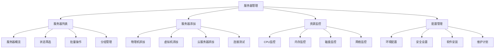

**服务器列表界面**
```
┌─────────────────────────────────────────────────────────────┐
│ 🖥️ 服务器管理                    [➕ 添加服务器] [📊 监控]    │
├─────────────────────────────────────────────────────────────┤
│ 🔍 [搜索服务器...] [类型 ▼] [状态 ▼] [分组 ▼] [🔄] [⚙️]    │
├─────────────────────────────────────────────────────────────┤
│ ☑️ 服务器名称    IP地址        类型    状态    CPU   内存   操作│
│ ☑️ web-server-01 192.168.1.10 物理机  🟢运行  45%   60%   [⚙️]│
│ ☑️ db-server-01  192.168.1.20 虚拟机  🟢运行  30%   80%   [⚙️]│
│ ☑️ app-server-01 10.0.1.100   云服务器🟢运行  25%   40%   [⚙️]│
│ ☑️ test-server-01 192.168.1.30 虚拟机  🟡维护  0%    10%   [⚙️]│
│ ☑️ backup-srv-01 192.168.1.40 物理机  🔴异常  95%   90%   [⚙️]│
├─────────────────────────────────────────────────────────────┤
│ 已选择 3 个服务器  [🔄 批量重启] [⚙️ 批量配置] [📊 性能报告] │
│ 共 25 个服务器，当前第 1-10 页                   [◀️] [▶️]  │
└─────────────────────────────────────────────────────────────┘
```

#### **8.1.2 智能资源调度**

**资源调度算法**
```typescript
interface ServerResource {
  serverId: string;
  cpu: { total: number; used: number; available: number };
  memory: { total: number; used: number; available: number };
  disk: { total: number; used: number; available: number };
  network: { bandwidth: number; usage: number };
  location: string;
  tags: string[];
  score: number;
}

interface ResourceRequirement {
  cpu: number;
  memory: number;
  disk: number;
  location?: string;
  tags?: string[];
  priority: 'high' | 'medium' | 'low';
}

// 智能调度算法
function selectOptimalServer(
  servers: ServerResource[],
  requirement: ResourceRequirement
): ServerResource {
  return servers
    .filter(server =>
      server.cpu.available >= requirement.cpu &&
      server.memory.available >= requirement.memory &&
      server.disk.available >= requirement.disk
    )
    .map(server => ({
      ...server,
      score: calculateScore(server, requirement)
    }))
    .sort((a, b) => b.score - a.score)[0];
}
```

### 8.2 数据库管理

#### **8.2.1 数据库创建界面**

**一键创建数据库界面**
```
┌─────────────────────────────────────────────────────────────┐
│ 🗄️ 创建数据库实例                                           │
├─────────────────────────────────────────────────────────────┤
│ 数据库类型: [PostgreSQL ▼]                                  │
│ ┌─────────────────────────────────────────────────────────┐ │
│ │ 📊 关系型数据库                                         │ │
│ │ • PostgreSQL  • MySQL  • SQL Server                    │ │
│ │                                                         │ │
│ │ 📄 文档型数据库                                         │ │
│ │ • MongoDB  • CouchDB                                    │ │
│ │                                                         │ │
│ │ ⚡ 缓存数据库                                           │ │
│ │ • Redis  • Memcached                                    │ │
│ │                                                         │ │
│ │ 📈 大数据存储                                           │ │
│ │ • Hadoop  • HBase  • Cassandra                         │ │
│ └─────────────────────────────────────────────────────────┘ │
│                                                             │
│ 实例名称: [my-postgres-db                    ]              │
│ 版本选择: [PostgreSQL 14 ▼]                                │
│                                                             │
│ 资源配置:                                                   │
│ CPU: [4核 ▼]  内存: [8GB ▼]  存储: [100GB ▼]               │
│                                                             │
│ 🤖 智能部署建议:                                            │
│ 推荐服务器: web-server-01 (负载较低，性能最优)              │
│ 预计部署时间: 3-5分钟                                       │
│ 资源使用预估: CPU 15%, 内存 25%                             │
│                                                             │
│ 高级配置: [展开 ▼]                                          │
│ ┌─────────────────────────────────────────────────────────┐ │
│ │ 备份策略: [每日备份 ▼]  保留期: [30天 ▼]                │ │
│ │ 监控告警: [✅] 启用     连接数限制: [100]                │ │
│ │ 安全设置: [✅] SSL加密  [✅] 访问控制                    │ │
│ └─────────────────────────────────────────────────────────┘ │
│                                                             │
│ [🚀 立即创建] [💾 保存模板] [🧪 测试配置] [❌ 取消]         │
└─────────────────────────────────────────────────────────────┘
```

#### **8.2.2 数据库监控面板**

**数据库监控界面**
```
┌─────────────────────────────────────────────────────────────┐
│ 📊 数据库监控面板                                           │
├─────────────────────────────────────────────────────────────┤
│ 📈 实时指标                                                 │
│ ┌─────────────┬─────────────┬─────────────┬─────────────────┐ │
│ │ 🔗 连接数    │ ⚡ QPS      │ 📊 CPU使用  │ 💾 内存使用     │ │
│ │ 45/100      │ 1,234      │ 35%        │ 2.1GB/8GB     │ │
│ │ ↗️ +5 (5min) │ ↗️ +200     │ ↘️ -5%      │ ↗️ +0.3GB       │ │
│ └─────────────┴─────────────┴─────────────┴─────────────────┘ │
│                                                             │
│ 🐌 慢查询监控 (最近1小时)                                   │
│ ┌─────────────────────────────────────────────────────────┐ │
│ │ 时间      查询语句                    执行时间  影响行数  │ │
│ │ 14:30:25  SELECT * FROM users WHERE... 2.3s    1,234   │ │
│ │ 14:28:15  UPDATE orders SET status...  1.8s    456     │ │
│ │ 14:25:10  SELECT COUNT(*) FROM logs... 3.1s    50,000  │ │
│ │ [查看详细分析] [优化建议] [创建索引]                     │ │
│ └─────────────────────────────────────────────────────────┘ │
│                                                             │
│ 🔄 备份状态                                                 │
│ 最近备份: 2025-01-21 02:00:00 ✅ 成功                      │
│ 备份大小: 2.5GB  下次备份: 2025-01-22 02:00:00             │
│                                                             │
│ [📊 详细报告] [⚙️ 配置优化] [🔧 维护模式] [📋 导出数据]     │
└─────────────────────────────────────────────────────────────┘
```

### 8.3 容器管理

#### **8.3.1 容器编排界面**

**Kubernetes集群管理**
```
┌─────────────────────────────────────────────────────────────┐
│ 🐳 容器编排管理                                             │
├─────────────────────────────────────────────────────────────┤
│ 📊 集群概览                                                 │
│ 集群名称: production-k8s  版本: v1.28.0  状态: 🟢 健康      │
│ 节点数: 5个  Pod数: 23个  服务数: 12个                      │
│                                                             │
│ 🖥️ 节点状态                                                 │
│ ┌─────────────────────────────────────────────────────────┐ │
│ │ 节点名称        状态    CPU    内存    Pod数  角色       │ │
│ │ master-01      🟢就绪   25%    40%    8      master     │ │
│ │ worker-01      🟢就绪   60%    70%    5      worker     │ │
│ │ worker-02      🟢就绪   45%    55%    6      worker     │ │
│ │ worker-03      🟡维护   0%     10%    0      worker     │ │
│ │ worker-04      🟢就绪   35%    45%    4      worker     │ │
│ └─────────────────────────────────────────────────────────┘ │
│                                                             │
│ 🚀 应用部署                                                 │
│ ┌─────────────────────────────────────────────────────────┐ │
│ │ 应用名称    命名空间    副本数  状态    镜像版本         │ │
│ │ web-app     default     3/3     🟢运行  nginx:1.21     │ │
│ │ api-service backend     2/2     🟢运行  app:v2.1.0     │ │
│ │ database    database    1/1     🟢运行  postgres:14    │ │
│ │ redis       cache       1/1     🟢运行  redis:7.0      │ │
│ └─────────────────────────────────────────────────────────┘ │
│                                                             │
│ [➕ 部署应用] [📊 监控面板] [📋 查看日志] [⚙️ 集群配置]     │
└─────────────────────────────────────────────────────────────┘
```

### 8.4 存储管理

#### **8.4.1 统一存储管理界面**

**存储资源概览**
```
┌─────────────────────────────────────────────────────────────┐
│ 💾 存储资源管理                                             │
├─────────────────────────────────────────────────────────────┤
│ 📊 存储概览                                                 │
│ 总容量: 10TB  已使用: 6.5TB  可用: 3.5TB  使用率: 65%       │
│                                                             │
│ 🗂️ 存储类型分布                                             │
│ ┌─────────────────────────────────────────────────────────┐ │
│ │ 存储类型    容量      使用率    状态    性能等级         │ │
│ │ 对象存储    5TB       70%      🟢正常   高性能          │ │
│ │ 文件存储    3TB       60%      🟢正常   标准            │ │
│ │ 块存储      2TB       65%      🟢正常   高IOPS          │ │
│ └─────────────────────────────────────────────────────────┘ │
│                                                             │
│ 📈 存储使用趋势 (最近30天)                                  │
│ ┌─────────────────────────────────────────────────────────┐ │
│ │     使用量                                              │ │
│ │ 10TB ┤                                            ╭─   │ │
│ │  8TB ┤                                      ╭─────╯    │ │
│ │  6TB ┤                            ╭─────────╯          │ │
│ │  4TB ┤                    ╭───────╯                    │ │
│ │  2TB ┤            ╭───────╯                            │ │
│ │  0TB └────────────────────────────────────────────────  │ │
│ │      1月1日    1月10日    1月20日    今天              │ │
│ └─────────────────────────────────────────────────────────┘ │
│                                                             │
│ [➕ 添加存储] [📊 性能分析] [🔄 数据迁移] [⚙️ 存储配置]     │
└─────────────────────────────────────────────────────────────┘
```

## 9. 系统管理模块详细设计

### 8.1 用户管理

#### **8.1.1 用户管理界面设计**

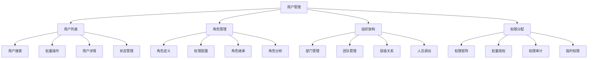

**用户列表界面**
```
┌─────────────────────────────────────────────────────────────┐
│ 👥 用户管理                    [➕ 新增用户] [📥 批量导入]    │
├─────────────────────────────────────────────────────────────┤
│ 🔍 [搜索用户...] [部门 ▼] [角色 ▼] [状态 ▼] [🔄] [⚙️]      │
├─────────────────────────────────────────────────────────────┤
│ ☑️ 用户名    邮箱           部门      角色      状态    操作  │
│ ☑️ 张三      zhang@xx.com  研发部    开发者    🟢活跃  [⚙️]  │
│ ☑️ 李四      li@xx.com     产品部    产品经理  🟢活跃  [⚙️]  │
│ ☑️ 王五      wang@xx.com   研发部    架构师    🟡离线  [⚙️]  │
│ ☑️ 赵六      zhao@xx.com   测试部    测试工程师🔴禁用  [⚙️]  │
│ ☑️ 孙七      sun@xx.com    运维部    DevOps    🟢活跃  [⚙️]  │
├─────────────────────────────────────────────────────────────┤
│ 已选择 3 个用户  [🔓 批量启用] [🔒 批量禁用] [🗑️ 批量删除]  │
│ 共 156 个用户，当前第 1-10 页                    [◀️] [▶️]  │
└─────────────────────────────────────────────────────────────┘
```

#### **8.1.2 用户详情和编辑**

**用户详情页面**
```
┌─────────────────────────────────────────────────────────────┐
│ 👤 用户详情 - 张三                        [✏️] [🔒] [🗑️]    │
├─────────────────────────────────────────────────────────────┤
│ 📋 基本信息                                                 │
│ 用户名: zhang_san        邮箱: zhang@example.com           │
│ 姓名: 张三              手机: 138****1234                  │
│ 部门: 研发部/前端组      职位: 高级前端工程师               │
│ 入职时间: 2023-01-15     最后登录: 2025-01-21 14:30        │
│                                                             │
│ 🔑 权限信息                                                 │
│ 主要角色: 开发者                                            │
│ 附加角色: 代码审查员                                        │
│ 权限组: 前端开发组, AI插件用户组                            │
│                                                             │
│ 📊 使用统计                                                 │
│ AI插件使用: 本月 234 次  代码提交: 本月 45 次               │
│ 代码审查: 本月 23 次     项目参与: 3 个活跃项目             │
│                                                             │
│ 🔐 安全设置                                                 │
│ 双因子认证: ✅ 已启用    API密钥: 2 个有效                  │
│ 登录设备: 3 个授权设备   安全等级: 高                       │
│                                                             │
│ 📝 操作日志 (最近10条)                                      │
│ 2025-01-21 14:30 登录系统                                   │
│ 2025-01-21 14:25 使用Claude插件生成代码                     │
│ 2025-01-21 14:20 提交代码到feature/user-auth分支            │
│ 2025-01-21 14:15 审查PR #123                               │
│ [查看完整日志]                                              │
│                                                             │
│ [💾 保存修改] [🔄 重置密码] [📧 发送邀请] [📊 详细报告]      │
└─────────────────────────────────────────────────────────────┘
```

### 8.2 权限管理

#### **8.2.1 RBAC权限模型**

**权限模型设计**
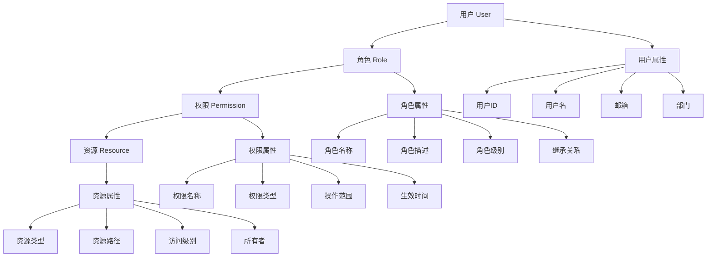

**权限矩阵配置**
```
┌─────────────────────────────────────────────────────────────┐
│ 🔐 权限矩阵配置                                             │
├─────────────────────────────────────────────────────────────┤
│ 资源/角色    管理员  项目经理  架构师  开发者  测试  DevOps  │
│ ─────────────────────────────────────────────────────────── │
│ 用户管理      ✅      ❌       ❌      ❌     ❌    ❌      │
│ 项目管理      ✅      ✅       👁️      👁️     👁️    👁️      │
│ AI插件管理    ✅      ✅       ✅      ❌     ❌    ✅      │
│ 代码仓库      ✅      ✅       ✅      ✅     👁️    ✅      │
│ CI/CD管理     ✅      ✅       ✅      👁️     👁️    ✅      │
│ 监控告警      ✅      👁️       ✅      👁️     👁️    ✅      │
│ 系统配置      ✅      ❌       ❌      ❌     ❌    ❌      │
│ 审计日志      ✅      👁️       👁️      ❌     ❌    👁️      │
│                                                             │
│ 图例: ✅ 完全控制  👁️ 只读访问  ❌ 无权限                   │
│                                                             │
│ [💾 保存配置] [🔄 重置] [📋 导出] [📥 导入] [🧪 测试权限]   │
└─────────────────────────────────────────────────────────────┘
```

#### **8.2.2 动态权限控制**

**权限控制策略**
```typescript
interface PermissionPolicy {
  id: string;
  name: string;
  type: 'static' | 'dynamic' | 'conditional';
  rules: PermissionRule[];
  priority: number;
  enabled: boolean;
}

interface PermissionRule {
  condition: string;          // 权限条件表达式
  action: 'allow' | 'deny';   // 允许或拒绝
  resources: string[];        // 适用资源
  timeRange?: TimeRange;      // 时间范围限制
  ipWhitelist?: string[];     // IP白名单
}

// 示例权限策略
const dynamicPermissions: PermissionPolicy[] = [
  {
    id: 'time-based-access',
    name: '工作时间访问控制',
    type: 'conditional',
    rules: [
      {
        condition: 'time.hour >= 9 && time.hour <= 18 && time.weekday <= 5',
        action: 'allow',
        resources: ['ai-plugins', 'code-generation'],
        timeRange: { start: '09:00', end: '18:00' }
      }
    ],
    priority: 1,
    enabled: true
  }
];
```

### 8.3 系统配置

#### **8.3.1 系统配置界面**

**配置管理界面**
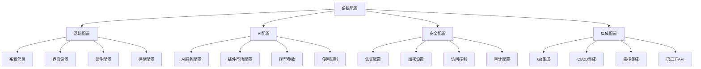

**系统配置页面**
```
┌─────────────────────────────────────────────────────────────┐
│ ⚙️ 系统配置                                                 │
├─────────────────────────────────────────────────────────────┤
│ 📋 基础配置                                                 │
│ 系统名称: [AI开发平台                    ]                  │
│ 系统版本: v1.0.0                                            │
│ 部署环境: [生产环境 ▼]                                      │
│ 时区设置: [Asia/Shanghai ▼]                                 │
│ 语言设置: [中文简体 ▼]                                      │
│                                                             │
│ 🤖 AI服务配置                                               │
│ 默认AI助手: [Claude Code ▼]                                 │
│ 并发限制: [50] 个请求/分钟                                   │
│ 超时设置: [30] 秒                                           │
│ 缓存时间: [3600] 秒                                         │
│ 成本控制: [✅] 启用  预算上限: [$1000] /月                   │
│                                                             │
│ 🔐 安全配置                                                 │
│ 密码策略: [✅] 强密码要求  [✅] 定期更换                     │
│ 会话超时: [30] 分钟                                         │
│ 登录限制: [5] 次失败后锁定                                   │
│ 双因子认证: [✅] 强制启用                                    │
│ API限流: [1000] 请求/小时                                   │
│                                                             │
│ 📧 邮件配置                                                 │
│ SMTP服务器: [smtp.example.com        ]                     │
│ 端口: [587]  加密: [TLS ▼]                                  │
│ 用户名: [noreply@example.com         ]                     │
│ 密码: [••••••••••••••••••••••••••••••]                     │
│ [🧪 测试连接]                                               │
│                                                             │
│ [💾 保存配置] [🔄 重置] [📤 导出] [📥 导入] [🔄 重启服务]   │
└─────────────────────────────────────────────────────────────┘
```

#### **8.3.2 配置版本管理**

**配置历史管理**
```
┌─────────────────────────────────────────────────────────────┐
│ 📚 配置版本历史                                             │
├─────────────────────────────────────────────────────────────┤
│ 版本      时间              操作员    变更内容        操作    │
│ ─────────────────────────────────────────────────────────── │
│ v1.2.3   2025-01-21 15:30  admin    AI并发限制调整   [👁️]  │
│ v1.2.2   2025-01-20 10:15  admin    邮件服务器更新   [👁️]  │
│ v1.2.1   2025-01-19 14:20  admin    安全策略更新     [👁️]  │
│ v1.2.0   2025-01-18 09:00  admin    新增AI插件配置   [👁️]  │
│ v1.1.9   2025-01-17 16:45  admin    数据库连接优化   [👁️]  │
│                                                             │
│ 📋 变更详情 (v1.2.3)                                        │
│ ┌─────────────────────────────────────────────────────────┐ │
│ │ 配置项: AI服务并发限制                                  │ │
│ │ 变更前: 30 个请求/分钟                                  │ │
│ │ 变更后: 50 个请求/分钟                                  │ │
│ │ 变更原因: 用户反馈响应速度慢，增加并发处理能力          │ │
│ │ 影响评估: 提升系统响应速度，增加服务器负载              │ │
│ └─────────────────────────────────────────────────────────┘ │
│                                                             │
│ [🔄 回滚到此版本] [📋 复制配置] [📊 影响分析] [📝 添加备注]  │
└─────────────────────────────────────────────────────────────┘
```

### 8.4 审计日志

#### **8.4.1 审计日志界面**

**日志查询界面**
```
┌─────────────────────────────────────────────────────────────┐
│ 📊 审计日志                                                 │
├─────────────────────────────────────────────────────────────┤
│ 🔍 筛选条件                                                 │
│ 时间范围: [2025-01-20] 至 [2025-01-21]                     │
│ 用户: [全部用户 ▼]  操作类型: [全部操作 ▼]                  │
│ 模块: [全部模块 ▼]  结果: [全部结果 ▼]                      │
│ 关键词: [搜索操作内容...                    ] [🔍 搜索]     │
│                                                             │
│ 📋 日志列表                                                 │
│ 时间              用户    操作          模块      结果  详情  │
│ ─────────────────────────────────────────────────────────── │
│ 01-21 15:30:25   张三    代码生成      AI插件    ✅    [👁️] │
│ 01-21 15:29:18   李四    创建项目      项目管理   ✅    [👁️] │
│ 01-21 15:28:45   王五    权限修改      用户管理   ✅    [👁️] │
│ 01-21 15:27:32   admin   配置更新      系统配置   ✅    [👁️] │
│ 01-21 15:26:15   张三    登录系统      认证模块   ✅    [👁️] │
│ 01-21 15:25:08   赵六    代码审查      开发流程   ❌    [👁️] │
│ 01-21 15:24:33   孙七    部署应用      CI/CD     ✅    [👁️] │
│                                                             │
│ 共找到 1,234 条记录，当前第 1-20 条            [◀️] [▶️]   │
│                                                             │
│ [📤 导出日志] [📊 统计分析] [⚠️ 异常检测] [🔔 设置告警]     │
└─────────────────────────────────────────────────────────────┘
```

#### **8.4.2 日志详情和分析**

**日志详情页面**
```
┌─────────────────────────────────────────────────────────────┐
│ 📋 审计日志详情                                             │
├─────────────────────────────────────────────────────────────┤
│ 🕐 基本信息                                                 │
│ 时间: 2025-01-21 15:30:25                                   │
│ 用户: 张三 (zhang_san)                                      │
│ IP地址: 192.168.1.100                                       │
│ 用户代理: Chrome/120.0.0.0                                  │
│ 会话ID: sess_abc123def456                                   │
│                                                             │
│ 🎯 操作信息                                                 │
│ 操作类型: AI代码生成                                        │
│ 目标模块: AI插件管理                                        │
│ 操作对象: Claude Code Plugin                                │
│ 请求方法: POST /api/ai/generate                             │
│ 操作结果: 成功 (200)                                        │
│                                                             │
│ 📝 详细内容                                                 │
│ 请求参数:                                                   │
│ {                                                           │
│   "prompt": "创建用户注册API",                              │
│   "language": "java",                                       │
│   "framework": "spring-boot"                                │
│ }                                                           │
│                                                             │
│ 响应结果:                                                   │
│ {                                                           │
│   "code": "...",                                            │
│   "quality_score": 92,                                     │
│   "generation_time": 2.3                                   │
│ }                                                           │
│                                                             │
│ 🔍 安全分析                                                 │
│ 风险等级: 低                                                │
│ 异常标记: 无                                                │
│ 合规检查: 通过                                              │
│                                                             │
│ [📋 复制详情] [🔗 关联日志] [⚠️ 标记异常] [📊 趋势分析]     │
└─────────────────────────────────────────────────────────────┘
```

---

**文档状态**: 完整版本完成 - 所有模块详细功能设计已完成
**包含内容**: 菜单模块、工作台、AI插件管理、开发流程、系统管理等完整功能设计
**文档版本**: v1.0 - 可用于开发实施的详细功能规格
