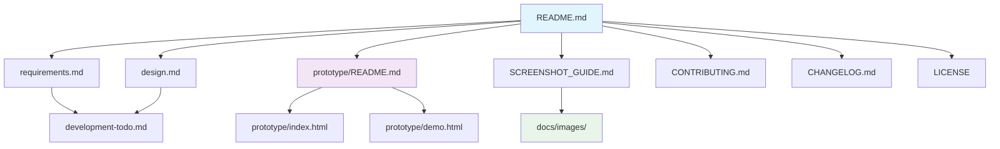

# 项目结构说明

本文档详细说明AI开发平台项目的目录结构和文件组织。

## 📁 根目录结构

```
ai-dev-platform/
├── README.md                    # 项目主说明文档
├── CHANGELOG.md                 # 版本更新日志
├── CONTRIBUTING.md              # 贡献指南
├── LICENSE                      # 项目许可证
├── docs/                        # 文档目录
├── prototype/                   # 高保真原型
└── .augment/                    # Augment Code配置（隐藏）
```

## 📚 docs/ 文档目录

```
docs/
├── requirements.md              # 需求文档
├── design.md                    # 设计文档
├── development-todo.md          # 开发计划
├── SCREENSHOT_GUIDE.md          # 截图指南
├── PROJECT_STRUCTURE.md         # 项目结构说明（本文档）
└── images/                      # 图片资源目录
    ├── README.md                # 图片目录说明
    ├── logo.png                 # 项目Logo（待添加）
    ├── architecture.png         # 系统架构图（待添加）
    ├── tech-architecture.png    # 技术架构图（待添加）
    ├── requirements-collection.png  # 需求收集界面（待添加）
    ├── project-management.png   # 项目管理界面（待添加）
    ├── code-management.png      # 代码管理界面（待添加）
    ├── deployment.png           # 部署管理界面（待添加）
    ├── monitoring.png           # 监控界面（待添加）
    ├── requirement-flow.gif     # 需求收集流程（待添加）
    ├── development-flow.gif     # 开发流程（待添加）
    └── deployment-flow.gif      # 部署流程（待添加）
```

## 🔧 prototype/ 原型目录

```
prototype/
├── index.html                   # 主页面入口
├── README.md                    # 原型使用说明
├── CHANGELOG.md                 # 原型更新日志
├── demo.html                    # 演示页面
├── development-workflow-demo.html    # 开发流程演示
├── requirement-split-demo.html      # 需求拆分演示
├── role-demo.html               # 角色切换演示
├── test-*.html                  # 各种测试页面
├── js/                          # JavaScript文件
│   └── app.js                   # 主应用逻辑
├── libs/                        # 第三方库
│   ├── simple-markdown-editor.css
│   └── simple-markdown-editor.js
└── 各种报告文档.md               # 开发过程报告
```

## 📋 文档分类

### 核心文档
- **README.md** - 项目概述、快速开始、功能介绍
- **requirements.md** - 详细的功能需求和业务流程
- **design.md** - 系统架构和技术设计

### 开发文档
- **development-todo.md** - 开发任务和进度规划
- **CONTRIBUTING.md** - 贡献指南和开发规范
- **SCREENSHOT_GUIDE.md** - 截图添加指导

### 项目管理
- **CHANGELOG.md** - 版本更新记录
- **LICENSE** - 项目许可证
- **PROJECT_STRUCTURE.md** - 项目结构说明

### 原型相关
- **prototype/README.md** - 原型使用指南
- **prototype/各种报告.md** - 开发过程记录

## 🎯 文件命名规范

### 文档文件
- 使用大写字母和下划线：`SCREENSHOT_GUIDE.md`
- 核心文档使用全大写：`README.md`, `CHANGELOG.md`
- 普通文档使用小写：`requirements.md`, `design.md`

### 图片文件
- 使用小写字母和连字符：`project-management.png`
- 静态截图使用PNG格式
- 动态演示使用GIF格式

### 代码文件
- HTML文件使用小写和连字符：`index.html`
- JavaScript文件使用小写：`app.js`
- CSS文件使用小写和连字符：`simple-markdown-editor.css`

## 🔗 文档关联关系



## 📊 文档维护

### 更新频率
- **README.md** - 功能更新时同步更新
- **CHANGELOG.md** - 每次版本发布时更新
- **requirements.md** - 需求变更时更新
- **design.md** - 架构调整时更新

### 维护责任
- **项目负责人** - README.md, CHANGELOG.md
- **产品经理** - requirements.md
- **技术负责人** - design.md, development-todo.md
- **开发人员** - prototype/相关文档

### 质量检查
- 定期检查链接有效性
- 确保截图与实际界面一致
- 验证代码示例的正确性
- 保持文档格式统一

## 🚀 扩展建议

### 未来可能添加的目录
```
ai-dev-platform/
├── src/                         # 源代码目录
│   ├── frontend/               # 前端代码
│   ├── backend/                # 后端代码
│   └── shared/                 # 共享代码
├── tests/                      # 测试代码
├── scripts/                    # 构建和部署脚本
├── docker/                     # Docker配置
└── deployment/                 # 部署配置
```

### 文档扩展
- **API.md** - API接口文档
- **DEPLOYMENT.md** - 部署指南
- **TESTING.md** - 测试指南
- **FAQ.md** - 常见问题解答
- **SECURITY.md** - 安全政策

---

这个项目结构设计确保了文档的完整性和可维护性，为项目的长期发展提供了良好的基础。
