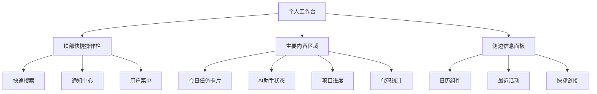

# AI开发平台系统UI设计文档

## 文档信息

**文档标题**: AI开发平台系统UI设计文档  
**文档版本**: v1.0  
**创建日期**: 2025-01-21  
**设计人员**: AI产品经理  
**基于文档**: 需求规格说明书、功能设计文档、功能清单表格  

## 1. 设计概述

### 1.1 设计理念

**核心设计原则**
- **简洁高效**: 界面简洁明了，操作高效便捷
- **一致性**: 统一的视觉语言和交互模式
- **智能化**: AI驱动的智能交互和个性化体验
- **响应式**: 适配多种设备和屏幕尺寸
- **可访问性**: 符合无障碍设计标准

**设计目标**
- 提升开发者工作效率50%以上
- 降低学习成本，新用户5分钟内上手
- 支持7×24小时高强度使用场景
- 实现跨平台一致的用户体验

### 1.2 用户体验策略

**以用户为中心的设计**
- **开发者优先**: 针对开发者工作习惯优化界面
- **任务导向**: 围绕开发任务流程设计交互
- **上下文感知**: 根据用户当前工作状态提供相关功能
- **渐进式披露**: 复杂功能分层展示，避免信息过载

## 2. 设计系统规范

### 2.1 色彩系统

#### **主色调 (Primary Colors) - 黑白极简风格**
```css
/* 主色调 - 黑白灰色系 */
--primary: #000000;           /* 主色 - 纯黑 */
--primary-foreground: #ffffff; /* 主色前景 - 纯白 */

/* 次要色调 */
--secondary: #f8f9fa;         /* 次要色 - 浅灰 */
--secondary-foreground: #1f2937; /* 次要色前景 */

/* 静音色调 */
--muted: #f1f5f9;            /* 静音背景 */
--muted-foreground: #64748b;  /* 静音前景 */

/* 强调色调 */
--accent: #f8fafc;           /* 强调背景 */
--accent-foreground: #0f172a; /* 强调前景 */
```

#### **中性色 (Neutral Colors)**
```css
/* 文字颜色 */
--foreground: #0f172a;        /* 主要文字 */
--muted-foreground: #64748b;  /* 次要文字 */
--disabled-foreground: #94a3b8; /* 禁用文字 */

/* 背景颜色 */
--background: #ffffff;        /* 主背景 */
--card: #ffffff;             /* 卡片背景 */
--popover: #ffffff;          /* 弹出层背景 */

/* 边框颜色 */
--border: #e2e8f0;           /* 基础边框 */
--input: #e2e8f0;            /* 输入框边框 */
--ring: #94a3b8;             /* 焦点环 */
```

#### **功能色 (Functional Colors)**
```css
/* 状态色 - 保留必要的功能色 */
--success: #16a34a;          /* 成功绿 */
--success-foreground: #ffffff;

--warning: #ea580c;          /* 警告橙 */
--warning-foreground: #ffffff;

--destructive: #dc2626;      /* 错误红 */
--destructive-foreground: #ffffff;

/* AI功能标识 - 使用黑白渐变 */
--ai-gradient: linear-gradient(135deg, #000000 0%, #374151 100%);
```

### 2.2 字体系统

#### **字体族 (Font Family)**
```css
/* 主字体 - 系统字体栈 */
--font-family-base: -apple-system, BlinkMacSystemFont, 'Segoe UI', 
                    'PingFang SC', 'Hiragino Sans GB', 'Microsoft YaHei', 
                    'Helvetica Neue', Helvetica, Arial, sans-serif;

/* 代码字体 */
--font-family-code: 'SFMono-Regular', Consolas, 'Liberation Mono', 
                    Menlo, Courier, monospace;

/* 数字字体 */
--font-family-number: 'Helvetica Neue', Helvetica, Arial, sans-serif;
```

#### **字体大小 (Font Size)**
```css
/* 标题字体 */
--font-size-h1: 38px;         /* 页面主标题 */
--font-size-h2: 30px;         /* 区域标题 */
--font-size-h3: 24px;         /* 模块标题 */
--font-size-h4: 20px;         /* 小节标题 */
--font-size-h5: 16px;         /* 子标题 */

/* 正文字体 */
--font-size-base: 14px;       /* 基础字体 */
--font-size-lg: 16px;         /* 大号字体 */
--font-size-sm: 12px;         /* 小号字体 */
--font-size-xs: 10px;         /* 极小字体 */
```

#### **字重 (Font Weight)**
```css
--font-weight-light: 300;     /* 细体 */
--font-weight-normal: 400;    /* 常规 */
--font-weight-medium: 500;    /* 中等 */
--font-weight-semibold: 600;  /* 半粗 */
--font-weight-bold: 700;      /* 粗体 */
```

### 2.3 间距系统

#### **基础间距 (Base Spacing)**
```css
/* 8px 基础网格系统 */
--space-xs: 4px;              /* 极小间距 */
--space-sm: 8px;              /* 小间距 */
--space-md: 16px;             /* 中等间距 */
--space-lg: 24px;             /* 大间距 */
--space-xl: 32px;             /* 极大间距 */
--space-xxl: 48px;            /* 超大间距 */
```

#### **组件间距 (Component Spacing)**
```css
/* 内边距 */
--padding-xs: 4px 8px;        /* 小按钮内边距 */
--padding-sm: 8px 16px;       /* 标准按钮内边距 */
--padding-md: 12px 20px;      /* 大按钮内边距 */
--padding-lg: 16px 24px;      /* 卡片内边距 */

/* 外边距 */
--margin-component: 16px;     /* 组件间距 */
--margin-section: 32px;       /* 区域间距 */
--margin-page: 48px;          /* 页面间距 */
```

### 2.4 圆角系统

```css
--border-radius-sm: 2px;      /* 小圆角 */
--border-radius-base: 4px;    /* 基础圆角 */
--border-radius-lg: 8px;      /* 大圆角 */
--border-radius-xl: 12px;     /* 超大圆角 */
--border-radius-round: 50%;   /* 圆形 */
```

### 2.5 阴影系统

```css
/* 极简阴影系统 - 微妙的层次感 */
--shadow-sm: 0 1px 2px 0 rgba(0, 0, 0, 0.05);
--shadow-base: 0 1px 3px 0 rgba(0, 0, 0, 0.1), 0 1px 2px 0 rgba(0, 0, 0, 0.06);
--shadow-md: 0 4px 6px -1px rgba(0, 0, 0, 0.1), 0 2px 4px -1px rgba(0, 0, 0, 0.06);
--shadow-lg: 0 10px 15px -3px rgba(0, 0, 0, 0.1), 0 4px 6px -2px rgba(0, 0, 0, 0.05);
--shadow-xl: 0 20px 25px -5px rgba(0, 0, 0, 0.1), 0 10px 10px -5px rgba(0, 0, 0, 0.04);

/* 交互阴影 */
--shadow-hover: 0 4px 6px -1px rgba(0, 0, 0, 0.1), 0 2px 4px -1px rgba(0, 0, 0, 0.06);
--shadow-focus: 0 0 0 3px rgba(0, 0, 0, 0.1);
```

## 3. 布局系统

### 3.1 栅格系统

#### **响应式断点 (Breakpoints)**
```css
/* 移动端 */
--breakpoint-xs: 480px;       /* 超小屏 */
--breakpoint-sm: 768px;       /* 小屏 */

/* 桌面端 */
--breakpoint-md: 992px;       /* 中屏 */
--breakpoint-lg: 1200px;      /* 大屏 */
--breakpoint-xl: 1600px;      /* 超大屏 */
```

#### **栅格配置**
- **24栅格系统**: 基于24列的灵活栅格布局
- **流式布局**: 支持百分比和固定宽度混合
- **响应式**: 不同屏幕尺寸自动适配

### 3.2 页面布局

#### **整体布局结构**
```
┌─────────────────────────────────────────────────────────────┐
│                        顶部导航栏                            │
├─────────────────────────────────────────────────────────────┤
│ 侧边栏 │                   主内容区域                        │
│ 导航   │  ┌─────────────────────────────────────────────┐   │
│        │  │              页面头部                        │   │
│        │  ├─────────────────────────────────────────────┤   │
│        │  │                                             │   │
│        │  │              内容区域                        │   │
│        │  │                                             │   │
│        │  │                                             │   │
│        │  └─────────────────────────────────────────────┘   │
├─────────────────────────────────────────────────────────────┤
│                        底部信息栏                            │
└─────────────────────────────────────────────────────────────┘
```

#### **布局尺寸规范**
- **顶部导航栏**: 高度 64px
- **侧边栏**: 宽度 240px (展开) / 80px (收起)
- **页面头部**: 高度 56px
- **底部信息栏**: 高度 48px
- **内容区域**: 自适应剩余空间

### 3.3 组件布局

#### **卡片布局**
```css
.card {
  background: var(--bg-primary);
  border-radius: var(--border-radius-lg);
  box-shadow: var(--shadow-base);
  padding: var(--space-lg);
  margin-bottom: var(--space-md);
}
```

#### **表格布局**
```css
.table-container {
  background: var(--bg-primary);
  border-radius: var(--border-radius-base);
  overflow: hidden;
  box-shadow: var(--shadow-sm);
}
```

#### **表单布局**
```css
.form-container {
  max-width: 600px;
  margin: 0 auto;
  padding: var(--space-xl);
}

.form-item {
  margin-bottom: var(--space-lg);
}
```

## 4. 组件设计规范

### 4.1 基础组件

#### **按钮 (Button)**

**主要按钮 (Primary Button)**
```css
.btn-primary {
  background: var(--primary);
  color: var(--primary-foreground);
  border: none;
  border-radius: var(--border-radius-base);
  padding: var(--padding-sm);
  font-size: var(--font-size-base);
  font-weight: var(--font-weight-medium);
  cursor: pointer;
  transition: all 0.2s ease;
}

.btn-primary:hover {
  background: #1f2937;
  box-shadow: var(--shadow-hover);
}

.btn-primary:focus-visible {
  outline: none;
  box-shadow: var(--shadow-focus);
}
```

**按钮尺寸规范**
- **大按钮**: 高度 40px，内边距 12px 20px
- **标准按钮**: 高度 32px，内边距 8px 16px
- **小按钮**: 高度 24px，内边距 4px 8px

**按钮状态设计**
```
┌─────────────────────────────────────────────────────────────┐
│ 按钮状态                                                     │
├─────────────────────────────────────────────────────────────┤
│ [正常状态] [悬浮状态] [点击状态] [禁用状态] [加载状态]        │
│                                                             │
│ ⚫ 主要按钮   🟢 成功按钮   🟠 警告按钮   🔴 危险按钮        │
│ ⚪ 次要按钮   🔗 链接按钮   👻 幽灵按钮   📝 文本按钮        │
└─────────────────────────────────────────────────────────────┘
```

#### **输入框 (Input)**

**基础输入框**
```css
.input-base {
  width: 100%;
  height: 32px;
  padding: 8px 12px;
  border: 1px solid var(--border);
  border-radius: var(--border-radius-base);
  font-size: var(--font-size-base);
  background: var(--background);
  color: var(--foreground);
  transition: all 0.2s ease;
}

.input-base:focus {
  border-color: var(--ring);
  box-shadow: var(--shadow-focus);
  outline: none;
}

.input-base:disabled {
  background: var(--muted);
  color: var(--disabled-foreground);
  cursor: not-allowed;
}
```

**输入框状态**
- **正常状态**: 默认边框色
- **聚焦状态**: 蓝色边框 + 阴影
- **错误状态**: 红色边框 + 错误提示
- **禁用状态**: 灰色背景 + 禁用样式

#### **选择器 (Select)**

**下拉选择器设计**
```
┌─────────────────────────────────────────┐
│ 请选择数据库类型                ▼       │
├─────────────────────────────────────────┤
│ 📊 关系型数据库                         │
│   • PostgreSQL                         │
│   • MySQL                              │
│   • SQL Server                         │
│                                         │
│ 📄 文档型数据库                         │
│   • MongoDB                            │
│   • CouchDB                            │
│                                         │
│ ⚡ 缓存数据库                           │
│   • Redis                              │
│   • Memcached                          │
└─────────────────────────────────────────┘
```

#### **开关 (Switch)**

**开关组件设计**
```css
.switch {
  width: 44px;
  height: 24px;
  background: var(--muted);
  border-radius: 12px;
  position: relative;
  cursor: pointer;
  transition: all 0.2s ease;
  border: 1px solid var(--border);
}

.switch.checked {
  background: var(--primary);
  border-color: var(--primary);
}

.switch-handle {
  width: 20px;
  height: 20px;
  background: var(--background);
  border-radius: 50%;
  position: absolute;
  top: 1px;
  left: 1px;
  transition: all 0.2s ease;
  box-shadow: var(--shadow-sm);
}

.switch.checked .switch-handle {
  left: 21px;
}
```

### 4.2 数据展示组件

#### **表格 (Table)**

**表格设计规范**
```css
.table {
  width: 100%;
  border-collapse: collapse;
  background: var(--card);
  border-radius: var(--border-radius-lg);
  overflow: hidden;
  border: 1px solid var(--border);
}

.table th {
  background: var(--muted);
  padding: 12px 16px;
  text-align: left;
  font-weight: var(--font-weight-medium);
  color: var(--muted-foreground);
  border-bottom: 1px solid var(--border);
  font-size: var(--font-size-sm);
}

.table td {
  padding: 12px 16px;
  border-bottom: 1px solid var(--border);
  color: var(--foreground);
}

.table tr:hover {
  background: var(--accent);
}

.table tr:last-child td {
  border-bottom: none;
}
```

**表格功能组件**
- **排序**: 列标题点击排序，箭头指示方向
- **筛选**: 列头筛选器，支持多条件筛选
- **分页**: 底部分页器，显示总数和页码
- **操作列**: 右侧操作按钮，支持编辑、删除等

#### **卡片 (Card)**

**信息卡片设计**
```
┌─────────────────────────────────────────┐
│ 🤖 Claude Code Assistant               │
│ ⭐⭐⭐⭐⭐ 4.8 (1,234 评价)              │
│                                         │
│ 📝 Anthropic官方代码生成插件             │
│ 🏷️ 代码生成 | 代码优化 | 多语言支持       │
│                                         │
│ 💰 免费 | 📊 10K+ 下载 | 🔄 v2.1.0      │
│                                         │
│ [📥 安装] [👁️ 详情] [⭐ 收藏]           │
└─────────────────────────────────────────┘
```

#### **统计卡片 (Stat Card)**

**数据统计卡片**
```
┌─────────────────┬─────────────────┬─────────────────┐
│ 📊 总请求数      │ ⚡ 平均响应时间   │ ✅ 成功率        │
│ 12,345         │ 1.2s           │ 99.2%          │
│ ↗️ +15% (24h)   │ ↘️ -0.3s (24h)  │ ↗️ +0.5% (24h)  │
└─────────────────┴─────────────────┴─────────────────┘
```

### 4.3 反馈组件

#### **消息提示 (Message)**

**消息类型设计**
```css
/* 成功消息 */
.message-success {
  background: #f0fdf4;
  border: 1px solid #bbf7d0;
  color: var(--success);
  border-radius: var(--border-radius-base);
  padding: 12px 16px;
}

/* 警告消息 */
.message-warning {
  background: #fffbeb;
  border: 1px solid #fed7aa;
  color: var(--warning);
  border-radius: var(--border-radius-base);
  padding: 12px 16px;
}

/* 错误消息 */
.message-destructive {
  background: #fef2f2;
  border: 1px solid #fecaca;
  color: var(--destructive);
  border-radius: var(--border-radius-base);
  padding: 12px 16px;
}

/* 信息消息 */
.message-info {
  background: var(--muted);
  border: 1px solid var(--border);
  color: var(--muted-foreground);
  border-radius: var(--border-radius-base);
  padding: 12px 16px;
}
```

#### **加载状态 (Loading)**

**加载动画设计**
```css
.loading-spinner {
  width: 20px;
  height: 20px;
  border: 2px solid var(--muted);
  border-top: 2px solid var(--primary);
  border-radius: 50%;
  animation: spin 1s linear infinite;
}

@keyframes spin {
  0% { transform: rotate(0deg); }
  100% { transform: rotate(360deg); }
}

/* 点状加载动画 */
.loading-dots {
  display: flex;
  gap: 4px;
}

.loading-dots span {
  width: 6px;
  height: 6px;
  background: var(--muted-foreground);
  border-radius: 50%;
  animation: pulse 1.4s ease-in-out infinite both;
}

.loading-dots span:nth-child(1) { animation-delay: -0.32s; }
.loading-dots span:nth-child(2) { animation-delay: -0.16s; }
.loading-dots span:nth-child(3) { animation-delay: 0; }
```

#### **进度条 (Progress)**

**进度条设计**
```css
.progress-bar {
  width: 100%;
  height: 8px;
  background: var(--muted);
  border-radius: 4px;
  overflow: hidden;
}

.progress-fill {
  height: 100%;
  background: var(--primary);
  border-radius: 4px;
  transition: width 0.3s ease;
}

/* 条纹进度条 */
.progress-striped .progress-fill {
  background-image: linear-gradient(
    45deg,
    rgba(255, 255, 255, 0.15) 25%,
    transparent 25%,
    transparent 50%,
    rgba(255, 255, 255, 0.15) 50%,
    rgba(255, 255, 255, 0.15) 75%,
    transparent 75%,
    transparent
  );
  background-size: 16px 16px;
  animation: progress-bar-stripes 1s linear infinite;
}

@keyframes progress-bar-stripes {
  0% { background-position: 16px 0; }
  100% { background-position: 0 0; }
}
```

### 4.4 导航组件

#### **面包屑 (Breadcrumb)**

**面包屑导航设计**
```
首页 > AI插件管理 > 已安装插件 > Claude Code 配置
```

```css
.breadcrumb {
  display: flex;
  align-items: center;
  font-size: var(--font-size-sm);
  color: var(--text-secondary);
}

.breadcrumb-item {
  display: flex;
  align-items: center;
}

.breadcrumb-separator {
  margin: 0 8px;
  color: var(--text-disabled);
}
```

#### **标签页 (Tabs)**

**标签页设计**
```css
.tabs {
  border-bottom: 1px solid var(--border);
  background: var(--background);
}

.tab-item {
  padding: 12px 16px;
  cursor: pointer;
  border-bottom: 2px solid transparent;
  transition: all 0.2s ease;
  color: var(--muted-foreground);
  font-weight: var(--font-weight-medium);
}

.tab-item.active {
  color: var(--foreground);
  border-bottom-color: var(--primary);
}

.tab-item:hover:not(.active) {
  color: var(--foreground);
  background: var(--accent);
}

.tab-item:focus-visible {
  outline: none;
  box-shadow: var(--shadow-focus);
}
```

## 5. 页面设计规范

### 5.1 工作台页面设计

#### **个人工作台布局**



**工作台卡片设计**
```
┌─────────────────────────────────────────────────────────────┐
│ 📋 今日任务 (5)                           [查看全部] [➕]    │
├─────────────────────────────────────────────────────────────┤
│ ⚡ 高优先级                                                  │
│ • 完成用户注册API开发                    [进行中] [🔄]      │
│ • 修复登录页面样式问题                   [待开始] [▶️]      │
│                                                             │
│ 📊 中优先级                                                  │
│ • 优化数据库查询性能                     [Review] [👁️]     │
│ • 编写单元测试用例                       [测试中] [🧪]      │
│                                                             │
│ 📝 低优先级                                                  │
│ • 更新项目文档                           [待开始] [📝]      │
└─────────────────────────────────────────────────────────────┘
```

#### **AI助手状态卡片**
```
┌─────────────────────────────────────────────────────────────┐
│ 🤖 AI助手状态                            [配置] [统计]      │
├─────────────────────────────────────────────────────────────┤
│ Claude Code      🟢 在线    响应: 1.2s   今日: 23次使用     │
│ Gemini Code      🟢 在线    响应: 0.8s   今日: 15次使用     │
│ Cursor AI        🟡 忙碌    响应: 2.1s   今日: 8次使用      │
│ GitHub Copilot   🔴 离线    响应: --     今日: 0次使用      │
│                                                             │
│ 💡 推荐: 当前项目适合使用 Claude Code 进行代码生成          │
│ [🔄 切换默认AI] [📊 使用报告] [⚙️ 插件管理]                │
└─────────────────────────────────────────────────────────────┘
```

### 5.2 AI插件管理页面设计

#### **插件市场页面布局**

**页面头部**
```
┌─────────────────────────────────────────────────────────────┐
│ 🛒 AI插件市场                                               │
│ 发现和安装强大的AI代码助手插件，提升开发效率                 │
├─────────────────────────────────────────────────────────────┤
│ 🔍 [搜索插件...                    ] [🔍] [高级筛选 ▼]     │
│                                                             │
│ 📂 分类: [全部] [代码生成] [代码审查] [测试生成] [需求分析]  │
│ 🏷️ 标签: #免费 #付费 #官方 #社区 #新发布 #热门              │
└─────────────────────────────────────────────────────────────┘
```

**插件网格布局**
```
┌─────────────────┬─────────────────┬─────────────────┬─────────────────┐
│ 🤖 Claude Code  │ 🤖 Gemini Code  │ 🤖 Cursor AI    │ 🤖 GitHub       │
│ Assistant       │ Assistant       │ Assistant       │ Copilot         │
│ ⭐⭐⭐⭐⭐ 4.8    │ ⭐⭐⭐⭐ 4.5      │ ⭐⭐⭐⭐ 4.3      │ ⭐⭐⭐⭐⭐ 4.9    │
│ 💰 免费          │ 💰 免费          │ 💰 付费          │ 💰 付费          │
│ 📊 10K+ 下载     │ 📊 8K+ 下载      │ 📊 5K+ 下载      │ 📊 50K+ 下载     │
│ [📥 安装]       │ [📥 安装]       │ [📥 安装]       │ [✅ 已安装]     │
│ [👁️ 详情]       │ [👁️ 详情]       │ [👁️ 详情]       │ [⚙️ 配置]       │
└─────────────────┴─────────────────┴─────────────────┴─────────────────┘
```

#### **插件详情页面设计**

**插件信息展示**
```
┌─────────────────────────────────────────────────────────────┐
│ 🤖 Claude Code Assistant                    [📥 安装插件]   │
├─────────────────────────────────────────────────────────────┤
│ 📸 插件截图轮播                                             │
│ ┌─────────────────────────────────────────────────────────┐ │
│ │                                                         │ │
│ │              插件功能演示截图                            │ │
│ │                                                         │ │
│ └─────────────────────────────────────────────────────────┘ │
│                                                             │
│ 📝 插件描述                                                 │
│ Anthropic官方开发的智能代码生成助手，支持多种编程语言...     │
│                                                             │
│ ⭐ 评分: 4.8/5.0 (1,234 评价)  📊 下载: 10,234 次          │
│ 🏷️ 标签: 代码生成, 代码优化, 多语言支持                     │
│ 📅 更新: 2025-01-20  🔄 版本: v2.1.0                       │
│                                                             │
│ 💻 系统要求                                                 │
│ • 平台版本: v1.0.0+                                         │
│ • 内存要求: 512MB+                                          │
│ • 网络要求: 稳定网络连接                                     │
│                                                             │
│ [📥 立即安装] [⭐ 收藏] [🔗 分享] [🐛 反馈]                 │
└─────────────────────────────────────────────────────────────┘
```

### 5.3 开发流程页面设计

#### **代码生成工作台**

**AI代码生成界面**
```
┌─────────────────────────────────────────────────────────────┐
│ 🤖 AI代码生成工作台                      [⚙️] [📊] [❓]    │
├─────────────────────────────────────────────────────────────┤
│ 📝 需求描述                                                 │
│ ┌─────────────────────────────────────────────────────────┐ │
│ │ 创建一个用户注册API，包含以下功能：                      │ │
│ │ 1. 邮箱格式验证                                         │ │
│ │ 2. 密码强度检查                                         │ │
│ │ 3. 用户名重复检查                                       │ │
│ │ 4. 发送验证邮件                                         │ │
│ │                                                         │ │
│ │ 技术要求：Spring Boot + MySQL + Redis                  │ │
│ └─────────────────────────────────────────────────────────┘ │
│                                                             │
│ 🤖 AI助手选择                                               │
│ [Claude ✓] [Gemini ✓] [Cursor ○] [协同模式 ✓]              │
│                                                             │
│ ┌─────────────────────┬─────────────────────────────────────┐ │
│ │ 📝 生成代码          │ 📊 质量分析                         │ │
│ │                     │                                     │ │
│ │ @RestController     │ 🎯 代码质量: 92/100                 │ │
│ │ @RequestMapping("/  │ ✅ 语法正确                         │ │
│ │ api/user")          │ ✅ 最佳实践                         │ │
│ │ public class User   │ ⚠️  异常处理可优化                  │ │
│ │ Controller {        │                                     │ │
│ │   @Autowired        │ 🔒 安全评分: 88/100                 │ │
│ │   private UserSer   │ ✅ 输入验证                         │ │
│ │   vice userService; │ ✅ 密码加密                         │ │
│ │                     │ ⚠️  需要添加限流                    │ │
│ │   @PostMapping("/   │                                     │ │
│ │   register")        │ 📈 性能评分: 85/100                 │ │
│ │   public Response   │ ✅ 查询优化                         │ │
│ │   register(@Valid   │ ⚠️  缓存策略待优化                  │ │
│ │   @RequestBody      │                                     │ │
│ │   UserDto dto) {    │ [📋 复制代码] [💾 保存]             │ │
│ │     // 验证逻辑     │ [🔄 重新生成] [🧪 生成测试]         │ │
│ │     ...             │                                     │ │
│ └─────────────────────┴─────────────────────────────────────┘ │
│                                                             │
│ [🚀 应用代码] [📚 生成文档] [🔍 代码审查] [📤 提交PR]        │
└─────────────────────────────────────────────────────────────┘
```

#### **代码审查页面**

**代码审查工作台**
```
┌─────────────────────────────────────────────────────────────┐
│ 🔍 代码审查 - PR #123: 用户注册功能实现      [✅] [❌] [💬]  │
├─────────────────────────────────────────────────────────────┤
│ 📊 AI分析结果                                               │
│ 🎯 总体评分: 87/100  🐛 发现问题: 3个  ⚠️  警告: 2个        │
│                                                             │
│ 📁 文件变更 (5个文件)                                       │
│ ┌─────────────────────────────────────────────────────────┐ │
│ │ ✅ src/main/java/UserController.java     +45 -0        │ │
│ │ ✅ src/main/java/UserService.java        +32 -0        │ │
│ │ ✅ src/main/java/UserDto.java            +18 -0        │ │
│ │ ⚠️  src/main/resources/application.yml    +5 -1         │ │
│ │ ✅ src/test/java/UserControllerTest.java +28 -0        │ │
│ └─────────────────────────────────────────────────────────┘ │
│                                                             │
│ ┌─────────────────────┬─────────────────────────────────────┐ │
│ │ 📝 代码变更          │ 🤖 AI审查意见                       │ │
│ │                     │                                     │ │
│ │ + @PostMapping("/   │ ❌ 高优先级问题                     │ │
│ │ + register")        │ 第15行: 缺少输入验证                │ │
│ │ + public Response   │ 建议: 添加@Valid注解验证            │ │
│ │ + register(@Request │                                     │ │
│ │ + Body UserDto dto) │ ⚠️  中优先级警告                    │ │
│ │ + {                 │ 第23行: 异常处理不完整              │ │
│ │ +   User user = new │ 建议: 添加具体异常类型              │ │
│ │ +   User(dto);      │                                     │ │
│ │ +   return userSer  │ ✅ 优点                             │ │
│ │ +   vice.save(user) │ • 代码结构清晰                      │ │
│ │ +   ;               │ • 命名规范良好                      │ │
│ │ + }                 │ • 遵循RESTful设计                   │ │
│ │                     │                                     │ │
│ │ [💬 添加评论]       │ [🔧 自动修复] [📋 应用建议]         │ │
│ └─────────────────────┴─────────────────────────────────────┘ │
│                                                             │
│ 💬 审查评论 (2)                                             │
│ 👤 张三 2小时前: 建议添加日志记录                           │
│ 🤖 AI助手 1小时前: 检测到潜在的SQL注入风险                  │
│                                                             │
│ [✅ 通过审查] [❌ 需要修改] [💬 添加评论] [📊 详细报告]      │
└─────────────────────────────────────────────────────────────┘
```

### 5.4 开发资源管理页面设计

#### **服务器管理页面**

**服务器概览仪表板**
```
┌─────────────────────────────────────────────────────────────┐
│ 🖥️ 服务器管理                    [➕ 添加服务器] [📊 监控]    │
├─────────────────────────────────────────────────────────────┤
│ 📊 资源概览                                                 │
│ ┌─────────────┬─────────────┬─────────────┬─────────────────┐ │
│ │ 🖥️ 总服务器  │ ⚡ 平均负载  │ 💾 内存使用  │ 💿 存储使用     │ │
│ │ 25台        │ 45%        │ 60%        │ 2.1TB/10TB     │ │
│ │ ↗️ +2 (本周) │ ↘️ -5%      │ ↗️ +10%     │ ↗️ +0.3TB       │ │
│ └─────────────┴─────────────┴─────────────┴─────────────────┘ │
│                                                             │
│ 🔍 [搜索服务器...] [类型 ▼] [状态 ▼] [分组 ▼] [🔄] [⚙️]    │
│                                                             │
│ 📋 服务器列表                                               │
│ ┌─────────────────────────────────────────────────────────┐ │
│ │ ☑️ 服务器名称    IP地址        类型    状态    CPU   内存 │ │
│ │ ☑️ web-01       192.168.1.10 物理机  🟢运行  45%   60% │ │
│ │ ☑️ db-01        192.168.1.20 虚拟机  🟢运行  30%   80% │ │
│ │ ☑️ app-01       10.0.1.100   云服务器🟢运行  25%   40% │ │
│ │ ☑️ test-01      192.168.1.30 虚拟机  🟡维护  0%    10% │ │
│ │ ☑️ backup-01    192.168.1.40 物理机  🔴异常  95%   90% │ │
│ └─────────────────────────────────────────────────────────┘ │
│                                                             │
│ 已选择 3 个服务器  [🔄 批量重启] [⚙️ 批量配置] [📊 性能报告] │
└─────────────────────────────────────────────────────────────┘
```

#### **数据库创建向导**

**数据库创建流程**
```
┌─────────────────────────────────────────────────────────────┐
│ 🗄️ 创建数据库实例 - 步骤 2/4                                │
├─────────────────────────────────────────────────────────────┤
│ 进度: [████████████████████████████████████████████████] 50% │
│                                                             │
│ 📊 选择数据库类型                                           │
│ ┌─────────────────────────────────────────────────────────┐ │
│ │ ⚪ PostgreSQL    ⚪ MySQL        ⚪ SQL Server          │ │
│ │ 🔵 MongoDB       ⚪ Redis        ⚪ Cassandra           │ │
│ │ ⚪ Neo4j         ⚪ InfluxDB      ⚪ 自定义               │ │
│ └─────────────────────────────────────────────────────────┘ │
│                                                             │
│ ⚙️ 配置参数                                                 │
│ 实例名称: [my-mongodb-cluster              ]                │
│ 版本选择: [MongoDB 6.0 ▼]                                  │
│ 副本集:   [✅] 启用 (推荐)  节点数: [3 ▼]                   │
│                                                             │
│ 💻 资源配置                                                 │
│ CPU:     [4核 ▼]     内存: [8GB ▼]                         │
│ 存储:    [100GB ▼]   IOPS: [3000 ▼]                       │
│                                                             │
│ 🤖 智能推荐                                                 │
│ ┌─────────────────────────────────────────────────────────┐ │
│ │ 推荐服务器: web-server-01                               │ │
│ │ 推荐理由: CPU负载较低(25%)，内存充足，网络延迟最小      │ │
│ │ 预计部署时间: 5-8分钟                                   │ │
│ │ 资源占用预估: CPU +15%, 内存 +25%, 存储 +100GB         │ │
│ └─────────────────────────────────────────────────────────┘ │
│                                                             │
│ [◀️ 上一步] [▶️ 下一步] [💾 保存草稿] [❌ 取消]             │
└─────────────────────────────────────────────────────────────┘
```

## 6. 交互设计规范

### 6.1 交互原则

#### **响应性原则**
- **即时反馈**: 用户操作后立即给出视觉反馈
- **状态指示**: 清晰显示当前操作状态和进度
- **错误处理**: 友好的错误提示和恢复建议
- **性能感知**: 通过动画和加载状态优化等待体验

#### **一致性原则**
- **操作一致**: 相同功能在不同页面保持一致的操作方式
- **视觉一致**: 统一的颜色、字体、间距、图标使用
- **交互一致**: 统一的手势、快捷键、导航模式
- **语言一致**: 统一的术语、提示文案、错误信息

### 6.2 动画设计

#### **过渡动画**
```css
/* 页面切换动画 */
.page-transition {
  transition: all 0.3s cubic-bezier(0.4, 0, 0.2, 1);
}

/* 卡片悬浮动画 */
.card-hover {
  transition: transform 0.2s ease, box-shadow 0.2s ease;
}

.card-hover:hover {
  transform: translateY(-2px);
  box-shadow: var(--shadow-lg);
}

/* 按钮点击动画 */
.button-click {
  transition: transform 0.1s ease;
}

.button-click:active {
  transform: scale(0.98);
}
```

#### **加载动画**
```css
/* 骨架屏动画 */
.skeleton {
  background: linear-gradient(90deg, #f0f0f0 25%, #e0e0e0 50%, #f0f0f0 75%);
  background-size: 200% 100%;
  animation: loading 1.5s infinite;
}

@keyframes loading {
  0% { background-position: 200% 0; }
  100% { background-position: -200% 0; }
}

/* 脉冲动画 */
.pulse {
  animation: pulse 2s infinite;
}

@keyframes pulse {
  0%, 100% { opacity: 1; }
  50% { opacity: 0.5; }
}
```

### 6.3 手势和快捷键

#### **鼠标交互**
- **单击**: 选择、激活、导航
- **双击**: 编辑、打开详情
- **右键**: 上下文菜单
- **拖拽**: 排序、移动、上传文件
- **滚轮**: 滚动、缩放

#### **键盘快捷键**
```
全局快捷键:
Ctrl + K     - 全局搜索
Ctrl + /     - 显示快捷键帮助
Ctrl + ,     - 打开设置
Esc          - 关闭弹窗/取消操作

导航快捷键:
Ctrl + 1-9   - 切换主菜单
Ctrl + Tab   - 切换标签页
Alt + ←/→    - 前进/后退

编辑快捷键:
Ctrl + S     - 保存
Ctrl + Z     - 撤销
Ctrl + Y     - 重做
Ctrl + A     - 全选
```

#### **触摸手势 (移动端)**
- **点击**: 选择和激活
- **长按**: 显示上下文菜单
- **滑动**: 滚动和导航
- **双指缩放**: 放大缩小
- **下拉刷新**: 刷新数据

### 6.4 状态反馈

#### **加载状态**
```
加载中...    [████████████████████████████████████████] 100%
正在连接AI服务...
正在生成代码...
正在分析代码质量...
部署完成 ✅
```

#### **操作反馈**
```css
/* 成功状态 */
.feedback-success {
  color: var(--success-green);
  background: #f6ffed;
  border-left: 4px solid var(--success-green);
}

/* 警告状态 */
.feedback-warning {
  color: var(--warning-orange);
  background: #fff7e6;
  border-left: 4px solid var(--warning-orange);
}

/* 错误状态 */
.feedback-error {
  color: var(--error-red);
  background: #fff2f0;
  border-left: 4px solid var(--error-red);
}
```

## 7. 响应式设计

### 7.1 断点设计

#### **响应式断点策略**
```css
/* 移动端优先设计 */
.container {
  width: 100%;
  padding: 0 16px;
}

/* 平板端 */
@media (min-width: 768px) {
  .container {
    max-width: 750px;
    margin: 0 auto;
  }
}

/* 桌面端 */
@media (min-width: 992px) {
  .container {
    max-width: 970px;
  }
}

/* 大屏桌面端 */
@media (min-width: 1200px) {
  .container {
    max-width: 1170px;
  }
}
```

### 7.2 移动端适配

#### **移动端导航设计**
```
┌─────────────────────────────────────────┐
│ ☰ AI开发平台              🔍 👤 🔔     │
├─────────────────────────────────────────┤
│                                         │
│              主内容区域                  │
│                                         │
│                                         │
├─────────────────────────────────────────┤
│ 🏠 工作台  🤖 AI插件  💻 开发  📊 监控  │
└─────────────────────────────────────────┘
```

#### **移动端卡片设计**
```css
/* 移动端卡片适配 */
@media (max-width: 767px) {
  .card {
    margin: 8px;
    padding: 16px;
    border-radius: 8px;
  }

  .card-grid {
    grid-template-columns: 1fr;
    gap: 8px;
  }
}
```

## 8. 主题系统

### 8.1 明暗主题切换

#### **亮色主题 (Light Theme)**
```css
:root[data-theme="light"] {
  /* 主色调 */
  --primary: #000000;
  --primary-foreground: #ffffff;

  /* 次要色调 */
  --secondary: #f8f9fa;
  --secondary-foreground: #1f2937;

  /* 背景色 */
  --background: #ffffff;
  --card: #ffffff;
  --popover: #ffffff;

  /* 静音色调 */
  --muted: #f1f5f9;
  --muted-foreground: #64748b;

  /* 强调色调 */
  --accent: #f8fafc;
  --accent-foreground: #0f172a;

  /* 文字色 */
  --foreground: #0f172a;

  /* 边框色 */
  --border: #e2e8f0;
  --input: #e2e8f0;
  --ring: #94a3b8;

  /* 功能色 */
  --success: #16a34a;
  --success-foreground: #ffffff;
  --warning: #ea580c;
  --warning-foreground: #ffffff;
  --destructive: #dc2626;
  --destructive-foreground: #ffffff;
}
```

#### **暗色主题 (Dark Theme)**
```css
:root[data-theme="dark"] {
  /* 主色调 */
  --primary: #ffffff;
  --primary-foreground: #000000;

  /* 次要色调 */
  --secondary: #1e293b;
  --secondary-foreground: #f1f5f9;

  /* 背景色 */
  --background: #0f172a;
  --card: #1e293b;
  --popover: #1e293b;

  /* 静音色调 */
  --muted: #334155;
  --muted-foreground: #94a3b8;

  /* 强调色调 */
  --accent: #1e293b;
  --accent-foreground: #f1f5f9;

  /* 文字色 */
  --foreground: #f1f5f9;

  /* 边框色 */
  --border: #334155;
  --input: #334155;
  --ring: #64748b;

  /* 功能色 */
  --success: #22c55e;
  --success-foreground: #000000;
  --warning: #f97316;
  --warning-foreground: #000000;
  --destructive: #ef4444;
  --destructive-foreground: #ffffff;
}
```

#### **主题切换组件**
```
┌─────────────────────────────────────────┐
│ 🎨 外观设置                             │
├─────────────────────────────────────────┤
│ 主题模式:                               │
│ ⚪ 浅色模式  🔵 深色模式  ⚪ 跟随系统    │
│                                         │
│ 界面风格:                               │
│ 🔵 极简黑白  ⚪ 经典灰度                │
│                                         │
│ 界面密度:                               │
│ ⚪ 紧凑  🔵 标准  ⚪ 宽松                │
│                                         │
│ 对比度:                                 │
│ ⚪ 标准  🔵 高对比度                    │
│                                         │
│ [💾 保存设置] [🔄 重置默认]             │
└─────────────────────────────────────────┘
```

### 8.2 极简风格变体

#### **标准极简主题 (默认)**
```css
:root[data-variant="minimal"] {
  /* 保持标准的黑白配色 */
  --primary: #000000;
  --primary-foreground: #ffffff;
  --border-radius-base: 6px;
  --border-radius-lg: 8px;
}
```

#### **高对比度主题**
```css
:root[data-variant="high-contrast"] {
  /* 增强对比度 */
  --primary: #000000;
  --primary-foreground: #ffffff;
  --foreground: #000000;
  --background: #ffffff;
  --border: #000000;
  --muted: #f5f5f5;
  --muted-foreground: #333333;
}
```

#### **柔和灰度主题**
```css
:root[data-variant="soft-gray"] {
  /* 柔和的灰度配色 */
  --primary: #374151;
  --primary-foreground: #ffffff;
  --foreground: #1f2937;
  --muted-foreground: #6b7280;
  --border: #d1d5db;
}
```

### 8.3 个性化定制

#### **界面密度设置**
```css
/* 紧凑模式 */
:root[data-density="compact"] {
  --space-sm: 4px;
  --space-md: 8px;
  --space-lg: 12px;
  --font-size-base: 12px;
  --component-height: 28px;
}

/* 标准模式 */
:root[data-density="standard"] {
  --space-sm: 8px;
  --space-md: 16px;
  --space-lg: 24px;
  --font-size-base: 14px;
  --component-height: 32px;
}

/* 宽松模式 */
:root[data-density="comfortable"] {
  --space-sm: 12px;
  --space-md: 24px;
  --space-lg: 36px;
  --font-size-base: 16px;
  --component-height: 40px;
}
```

## 9. 图标系统

### 9.1 图标规范

#### **图标设计原则**
- **一致性**: 统一的设计风格和视觉重量
- **识别性**: 清晰易懂的图形语言
- **适配性**: 支持多种尺寸和主题
- **可扩展**: 模块化的图标组织方式

#### **图标尺寸规范**
```css
/* 图标尺寸 */
.icon-xs { width: 12px; height: 12px; }   /* 极小图标 */
.icon-sm { width: 16px; height: 16px; }   /* 小图标 */
.icon-md { width: 20px; height: 20px; }   /* 中等图标 */
.icon-lg { width: 24px; height: 24px; }   /* 大图标 */
.icon-xl { width: 32px; height: 32px; }   /* 超大图标 */
```

### 9.2 功能图标

#### **导航图标**
```
🏠 首页      📊 仪表板    🤖 AI插件    💻 开发流程
📋 项目管理  📈 运维监控  🖥️ 资源管理  ⚙️ 系统设置
```

#### **操作图标**
```
➕ 添加      ✏️ 编辑      🗑️ 删除      👁️ 查看
📋 复制      📤 导出      📥 导入      🔄 刷新
⚙️ 设置      🔍 搜索      📊 统计      💾 保存
```

#### **状态图标**
```
✅ 成功      ❌ 失败      ⚠️ 警告      ℹ️ 信息
🟢 在线      🔴 离线      🟡 忙碌      ⚪ 未知
🔒 锁定      🔓 解锁      👁️ 可见      👁️‍🗨️ 隐藏
```

#### **AI功能图标**
```
🤖 AI助手    🧠 智能分析  ⚡ 自动生成  🔍 智能搜索
💡 智能建议  🎯 智能推荐  📝 智能编写  🔧 智能修复
```

### 9.3 图标使用规范

#### **图标与文字组合**
```css
.icon-text {
  display: flex;
  align-items: center;
  gap: 8px;
}

.icon-text .icon {
  flex-shrink: 0;
}

.icon-text .text {
  line-height: 1;
}
```

#### **图标颜色规范**
```css
/* 默认图标颜色 */
.icon-default { color: var(--muted-foreground); }

/* 主题色图标 */
.icon-primary { color: var(--primary); }

/* 状态色图标 */
.icon-success { color: var(--success); }
.icon-warning { color: var(--warning); }
.icon-destructive { color: var(--destructive); }

/* 禁用状态图标 */
.icon-disabled {
  color: var(--muted-foreground);
  opacity: 0.5;
}

/* 反色图标 */
.icon-inverse { color: var(--primary-foreground); }
```

## 10. 可访问性设计

### 10.1 无障碍设计原则

#### **感知性 (Perceivable)**
- **颜色对比**: 确保足够的颜色对比度 (WCAG AA标准)
- **文字大小**: 支持文字缩放到200%而不影响功能
- **替代文本**: 为图片和图标提供有意义的替代文本
- **多媒体**: 为音频和视频提供字幕和描述

#### **可操作性 (Operable)**
- **键盘导航**: 所有功能都可以通过键盘操作
- **焦点管理**: 清晰的焦点指示和合理的焦点顺序
- **时间控制**: 为有时间限制的内容提供控制选项
- **癫痫预防**: 避免闪烁频率过高的内容

#### **可理解性 (Understandable)**
- **语言标识**: 明确标识页面和内容的语言
- **一致性**: 保持导航和功能的一致性
- **错误处理**: 提供清晰的错误信息和修复建议
- **帮助信息**: 为复杂功能提供帮助和说明

#### **健壮性 (Robust)**
- **兼容性**: 与辅助技术良好兼容
- **语义化**: 使用语义化的HTML标记
- **标准遵循**: 遵循Web标准和最佳实践

### 10.2 键盘导航

#### **焦点样式**
```css
/* 焦点指示器 */
.focus-visible {
  outline: 2px solid var(--primary);
  outline-offset: 2px;
  border-radius: var(--border-radius-base);
}

/* 跳过链接 */
.skip-link {
  position: absolute;
  top: -40px;
  left: 6px;
  background: var(--primary);
  color: var(--primary-foreground);
  padding: 8px 12px;
  text-decoration: none;
  border-radius: var(--border-radius-base);
  font-weight: var(--font-weight-medium);
  z-index: 1000;
}

.skip-link:focus {
  top: 6px;
}
```

#### **Tab顺序管理**
```html
<!-- 合理的Tab顺序 -->
<nav role="navigation" aria-label="主导航">
  <a href="#main" class="skip-link">跳转到主内容</a>
  <ul>
    <li><a href="/dashboard" tabindex="1">工作台</a></li>
    <li><a href="/ai-plugins" tabindex="2">AI插件</a></li>
    <li><a href="/development" tabindex="3">开发流程</a></li>
  </ul>
</nav>

<main id="main" role="main" aria-label="主内容区域">
  <!-- 主要内容 -->
</main>
```

### 10.3 屏幕阅读器支持

#### **ARIA标签使用**
```html
<!-- 按钮状态 -->
<button aria-pressed="false" aria-label="切换AI助手">
  🤖 Claude Code
</button>

<!-- 进度指示 -->
<div role="progressbar"
     aria-valuenow="75"
     aria-valuemin="0"
     aria-valuemax="100"
     aria-label="代码生成进度">
  75%
</div>

<!-- 实时更新区域 -->
<div aria-live="polite" aria-atomic="true">
  代码生成完成
</div>

<!-- 表单验证 -->
<input type="email"
       aria-describedby="email-error"
       aria-invalid="true">
<div id="email-error" role="alert">
  请输入有效的邮箱地址
</div>
```

### 10.4 颜色对比度

#### **对比度标准**
```css
/* WCAG AA标准 - 4.5:1 */
.text-normal {
  color: var(--foreground); /* 对比度 > 4.5:1 */
  background: var(--background);
}

/* WCAG AAA标准 - 7:1 */
.text-high-contrast {
  color: #000000; /* 对比度 21:1 */
  background: #ffffff;
}

/* 大文字标准 - 3:1 */
.text-large {
  font-size: 18px;
  font-weight: bold;
  color: var(--muted-foreground); /* 对比度 > 3:1 */
  background: var(--background);
}

/* 暗色主题对比度 */
:root[data-theme="dark"] .text-normal {
  color: var(--foreground); /* 对比度 > 4.5:1 */
  background: var(--background);
}
```

## 11. 设计交付规范

### 11.1 设计文件组织

#### **文件命名规范**
```
UI设计文件/
├── 01-设计系统/
│   ├── 色彩系统.sketch
│   ├── 字体系统.sketch
│   ├── 组件库.sketch
│   └── 图标库.sketch
├── 02-页面设计/
│   ├── 工作台页面.sketch
│   ├── AI插件管理.sketch
│   ├── 开发流程.sketch
│   └── 资源管理.sketch
├── 03-交互原型/
│   ├── 主流程原型.axure
│   ├── AI交互原型.axure
│   └── 移动端原型.axure
└── 04-切图资源/
    ├── icons/
    ├── images/
    └── assets/
```

### 11.2 开发交付

#### **CSS变量导出**
```css
/* 导出的设计令牌 - 黑白极简主题 */
:root {
  /* 主色调 */
  --primary: #000000;
  --primary-foreground: #ffffff;
  --secondary: #f8f9fa;
  --secondary-foreground: #1f2937;

  /* 背景色 */
  --background: #ffffff;
  --card: #ffffff;
  --muted: #f1f5f9;
  --muted-foreground: #64748b;
  --accent: #f8fafc;
  --accent-foreground: #0f172a;

  /* 文字色 */
  --foreground: #0f172a;

  /* 边框色 */
  --border: #e2e8f0;
  --input: #e2e8f0;
  --ring: #94a3b8;

  /* 功能色 */
  --success: #16a34a;
  --success-foreground: #ffffff;
  --warning: #ea580c;
  --warning-foreground: #ffffff;
  --destructive: #dc2626;
  --destructive-foreground: #ffffff;

  /* 字体 */
  --font-size-xs: 10px;
  --font-size-sm: 12px;
  --font-size-base: 14px;
  --font-size-lg: 16px;

  /* 间距 */
  --space-xs: 4px;
  --space-sm: 8px;
  --space-md: 16px;
  --space-lg: 24px;

  /* 圆角 */
  --radius-sm: 2px;
  --radius-base: 6px;
  --radius-lg: 8px;

  /* 阴影 */
  --shadow-sm: 0 1px 2px 0 rgba(0, 0, 0, 0.05);
  --shadow-base: 0 1px 3px 0 rgba(0, 0, 0, 0.1), 0 1px 2px 0 rgba(0, 0, 0, 0.06);
  --shadow-lg: 0 10px 15px -3px rgba(0, 0, 0, 0.1), 0 4px 6px -2px rgba(0, 0, 0, 0.05);
}
```

#### **组件规范文档**
```markdown
## Button 组件规范

### 基础用法
- 主要按钮：用于主要操作，一个页面最多一个
- 次要按钮：用于次要操作
- 文字按钮：用于不重要的操作

### 尺寸规范
- 大按钮：高度40px，用于重要操作
- 标准按钮：高度32px，用于常规操作
- 小按钮：高度24px，用于紧凑布局

### 状态设计
- 正常状态：默认样式
- 悬浮状态：颜色变浅，添加阴影
- 点击状态：轻微缩放效果
- 禁用状态：灰色样式，不可点击
- 加载状态：显示加载图标
```

---

**文档状态**: 完整版本完成 - 系统UI设计文档已全部完成
**包含内容**: 设计系统规范、组件设计、页面设计、交互设计、响应式设计、主题系统、图标系统、可访问性设计、设计交付规范
**文档版本**: v1.0 - 可用于UI设计和前端开发的完整设计规范
