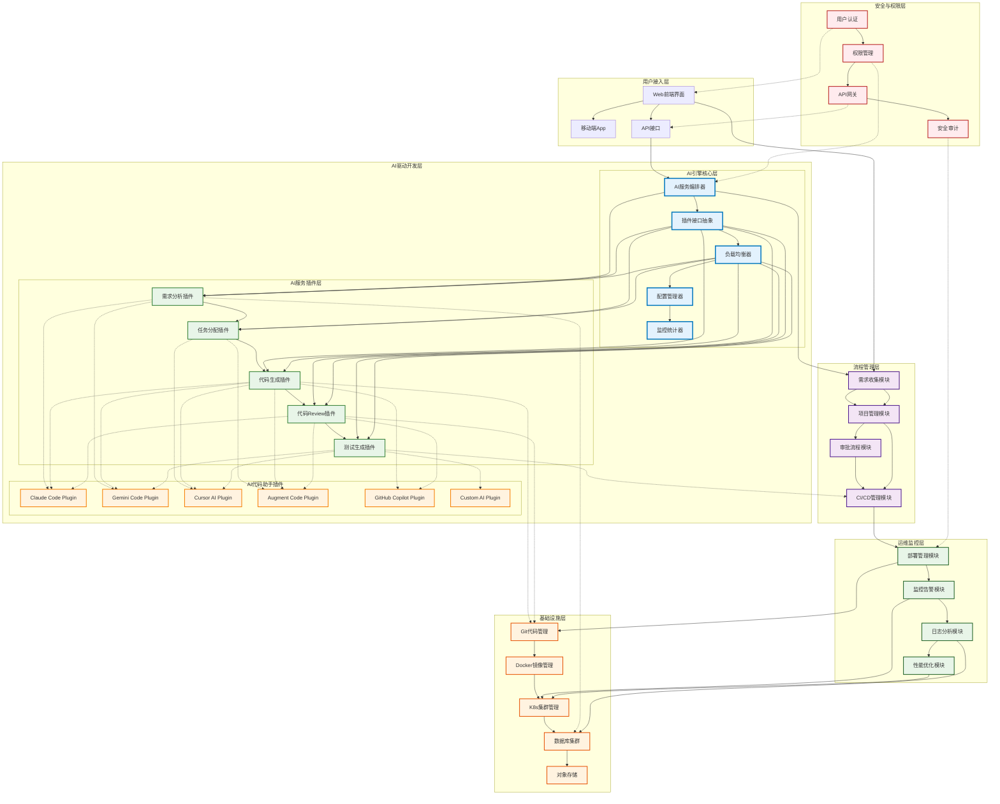
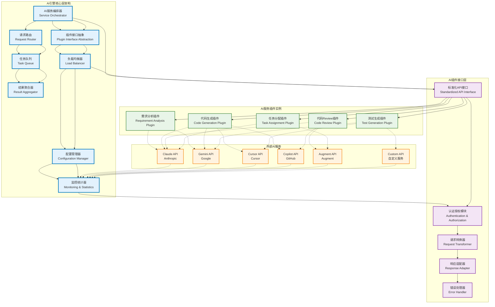
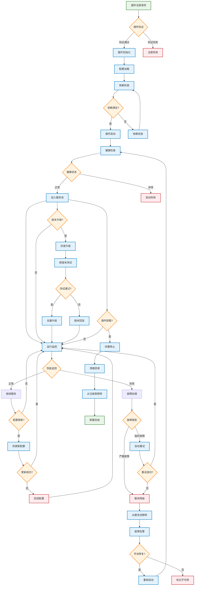
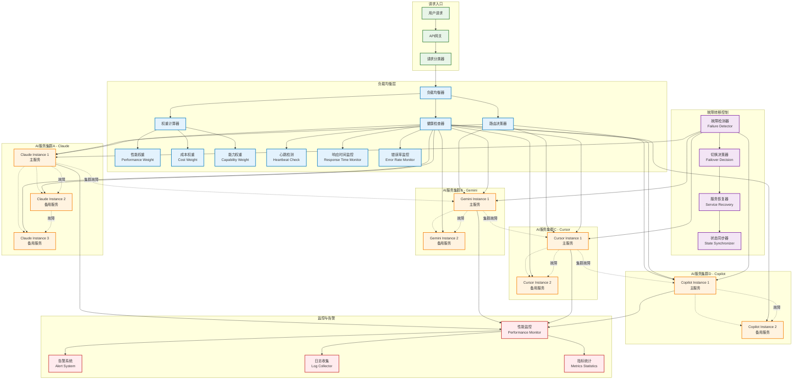

# AI开发平台需求分类与架构设计报告

## 1. 执行概述

**设计时间**: 2025-01-21  
**设计人员**: AI产品经理  
**设计范围**: 系统架构设计、功能模块分类、交互关系定义  

## 2. 功能模块重新分类

### 2.1 七层架构体系

基于深度分析结果，将原15条需求重新组织为七层架构体系：

#### **用户接入层 (Presentation Layer)**
- **Web前端界面**: 主要用户交互界面
- **移动端App**: 移动办公支持
- **API接口**: 第三方系统集成接口

#### **AI驱动开发层 (AI-Driven Development Layer)**

##### **AI引擎核心层 (AI Engine Core Layer)**
- **AI服务编排器**: 统一的AI服务调度和编排引擎
- **插件接口抽象**: 标准化的AI插件接口规范和适配器
- **负载均衡器**: AI服务请求的智能分发和负载均衡
- **配置管理器**: AI插件的动态配置和参数管理
- **监控统计器**: AI服务性能监控和使用统计分析

##### **AI服务插件层 (AI Service Plugin Layer)**
- **需求分析插件**: 支持多种AI助手的需求理解与分析能力
- **任务分配插件**: 智能任务分解与人员分配的AI服务集成
- **代码生成插件**: 集成多种AI代码助手的代码生成能力
- **代码Review插件**: 多AI引擎协同的智能代码质量检查
- **测试生成插件**: 自动化测试用例生成的AI服务插件

##### **支持的AI代码助手插件**
- **Claude Code Plugin**: Anthropic Claude的代码生成和分析能力
- **Gemini Code Plugin**: Google Gemini的智能编程助手集成
- **Cursor AI Plugin**: Cursor AI的代码编辑和重构能力
- **Augment Code Plugin**: Augment Code的上下文感知编程助手
- **GitHub Copilot Plugin**: GitHub Copilot的代码补全和生成
- **Custom AI Plugin**: 支持自定义AI服务的标准插件接口

#### **流程管理层 (Process Management Layer)**
- **需求收集模块**: 表单化需求收集与管理
- **项目管理模块**: 项目进度跟踪与协调
- **审批流程模块**: 多级审批工作流
- **CI/CD管理模块**: 持续集成与持续部署

#### **运维监控层 (Operations & Monitoring Layer)**
- **部署管理模块**: 应用部署、回退、灰度发布
- **监控告警模块**: 系统性能与业务监控
- **日志分析模块**: 集中化日志收集与分析
- **性能优化模块**: 系统性能调优建议

#### **开发资源管理层 (Development Resource Management Layer)**
- **服务器管理**: 物理机、虚拟机、云服务器统一管理
- **数据库管理**: 关系型、文档型、缓存、大数据等多类型数据库
- **容器管理**: Docker容器和Kubernetes集群编排
- **存储管理**: 对象存储、文件存储、块存储统一管理
- **网络管理**: 网络配置、负载均衡、域名管理

#### **基础设施层 (Infrastructure Layer)**
- **Git代码管理**: 版本控制与代码仓库
- **CI/CD引擎**: 持续集成与持续部署
- **服务网格**: 微服务通信与治理
- **安全基础设施**: 加密、证书、密钥管理

#### **安全与权限层 (Security & Authorization Layer)**
- **用户认证**: 多因子身份认证
- **权限管理**: RBAC角色权限控制
- **API网关**: 统一API入口与限流
- **安全审计**: 操作日志与安全监控

### 2.2 原需求映射关系

| 原需求编号 | 原需求描述 | 新架构层级 | 对应模块 |
|-----------|-----------|-----------|---------|
| 1 | 集成AI开发平台 | 全局 | 整体架构目标 |
| 2 | Git代码管理 | 基础设施层 | Git代码管理 |
| 3 | Docker镜像管理 | 基础设施层 | Docker镜像管理 |
| 4 | K8s部署管理 | 基础设施层 | K8s集群管理 |
| 5 | CI/CD管理 | 流程管理层 | CI/CD管理模块 |
| 6 | 需求收集功能 | 流程管理层 | 需求收集模块 |
| 7 | 需求分析功能 | AI驱动开发层 | 需求分析插件 |
| 8 | 任务分配功能 | AI驱动开发层 | 任务分配插件 |
| 9 | 代码开发功能 | AI驱动开发层 | 代码生成插件 |
| 10 | 代码review功能 | AI驱动开发层 | 代码Review插件 |
| 11 | 代码测试功能 | AI驱动开发层 | 测试生成插件 |
| 12 | 代码部署功能 | 运维监控层 | 部署管理模块 |
| 13 | 代码监控功能 | 运维监控层 | 监控告警模块 |
| 14 | 审批功能 | 流程管理层 | 审批流程模块 |
| 15 | 私有云数据库 | 开发资源管理层 | 数据库管理 |
| 16 | 服务器资源管理 | 开发资源管理层 | 服务器管理 |
| 17 | 容器编排管理 | 开发资源管理层 | 容器管理 |
| 18 | 存储资源管理 | 开发资源管理层 | 存储管理 |

## 3. 系统架构设计

### 3.1 整体架构图



*图3.1: AI开发平台插件化架构图 - 展示了六层架构体系，重点突出AI驱动开发层的插件化设计*

### 3.2 整体架构原则

**设计原则:**
- **分层解耦**: 各层职责清晰，降低耦合度
- **微服务架构**: 支持独立部署和扩展
- **AI优先**: AI能力贯穿整个开发流程
- **云原生**: 基于容器和K8s的云原生架构
- **安全第一**: 全链路安全保障

### 3.2 核心数据流

```
用户需求输入 → 需求收集模块 → AI服务编排器 → 需求分析插件 → 多AI助手并行处理
     ↓
项目管理模块 → 任务分配插件 → 代码生成插件 → 代码Review插件 → 测试生成插件
     ↓                    ↓              ↓               ↓              ↓
负载均衡器 → Claude/Gemini/Cursor → Augment/Copilot → 多AI协同 → 自定义AI插件
     ↓
CI/CD管理 → 部署管理 → 监控告警 → 性能优化
```

### 3.3 关键交互关系

#### **垂直交互 (跨层调用)**
1. **用户接入层 ↔ 流程管理层**: 用户操作触发业务流程
2. **流程管理层 ↔ AI驱动开发层**: 业务流程调用AI能力
3. **AI驱动开发层 ↔ 基础设施层**: AI操作代码和资源
4. **运维监控层 ↔ 基础设施层**: 监控基础设施状态

#### **水平交互 (同层协作)**
1. **AI引擎核心层协作**: 服务编排器↔插件接口抽象↔负载均衡器↔配置管理器↔监控统计器
2. **AI插件层协作**: 需求分析插件→任务分配插件→代码生成插件→Review插件→测试插件
3. **AI助手插件协作**: Claude/Gemini/Cursor/Augment/Copilot等多AI助手并行工作和结果融合
4. **流程模块间协作**: 需求收集→项目管理→审批→CI/CD
5. **开发资源管理协作**: 服务器管理↔数据库管理↔容器管理↔存储管理↔网络管理
6. **基础设施间协作**: Git→CI/CD引擎→服务网格→安全基础设施

#### **安全层贯穿**: 安全与权限层为所有其他层提供安全保障

## 4. 技术架构选型

### 4.1 前端技术栈
- **Web前端**: React/Vue.js + TypeScript
- **移动端**: React Native / Flutter
- **UI组件库**: Ant Design / Material-UI
- **状态管理**: Redux / Vuex

### 4.2 后端技术栈
- **API网关**: Kong / Zuul
- **微服务框架**: Spring Boot / Node.js
- **消息队列**: RabbitMQ / Apache Kafka
- **缓存**: Redis Cluster
- **搜索引擎**: Elasticsearch

### 4.3 AI技术栈

#### **AI引擎核心技术**
- **服务编排**: Apache Airflow / Kubernetes Jobs
- **插件框架**: OSGi / Spring Plugin Framework
- **负载均衡**: Nginx / HAProxy / Envoy
- **配置管理**: Consul / etcd / Apollo
- **监控统计**: Prometheus + Grafana / ELK Stack

#### **AI插件接口技术**
- **接口协议**: gRPC / RESTful API / GraphQL
- **消息队列**: Apache Kafka / RabbitMQ / Redis Streams
- **序列化**: Protocol Buffers / JSON / MessagePack
- **认证授权**: OAuth 2.0 / JWT / API Key
- **限流熔断**: Hystrix / Sentinel / Resilience4j

#### **AI模型服务技术**
- **机器学习框架**: TensorFlow / PyTorch / ONNX
- **自然语言处理**: BERT / GPT系列模型 / Transformer
- **代码分析**: Tree-sitter / AST解析 / Language Server Protocol
- **模型服务**: TensorFlow Serving / TorchServe / Triton Inference Server
- **模型管理**: MLflow / Kubeflow / DVC

#### **第三方AI集成**
- **Claude API**: Anthropic Claude API集成
- **Gemini API**: Google Gemini API集成
- **OpenAI API**: GPT/Codex API集成
- **GitHub API**: GitHub Copilot API集成
- **自定义API**: 支持自定义AI服务API集成

### 4.4 开发资源管理技术栈

#### **服务器管理技术**
- **虚拟化**: VMware vSphere / KVM / Hyper-V
- **云平台**: AWS EC2 / Azure VM / 阿里云ECS
- **配置管理**: Ansible / Puppet / Chef
- **监控代理**: Prometheus Node Exporter / Zabbix Agent

#### **数据库管理技术**
- **关系型数据库**: PostgreSQL / MySQL / SQL Server
- **文档型数据库**: MongoDB / CouchDB / Amazon DocumentDB
- **缓存数据库**: Redis Cluster / Memcached
- **大数据存储**: Hadoop HDFS / HBase / Cassandra
- **图数据库**: Neo4j / ArangoDB / Amazon Neptune
- **时序数据库**: InfluxDB / TimescaleDB / OpenTSDB
- **数据库代理**: ProxySQL / PgBouncer / MongoDB Router

#### **容器管理技术**
- **容器运行时**: Docker / containerd / CRI-O
- **容器编排**: Kubernetes / Docker Swarm
- **镜像仓库**: Harbor / Docker Registry / Amazon ECR
- **服务网格**: Istio / Linkerd / Consul Connect

#### **存储管理技术**
- **对象存储**: MinIO / AWS S3 / Azure Blob Storage
- **文件存储**: NFS / CIFS / GlusterFS / CephFS
- **块存储**: iSCSI / Fibre Channel / Ceph RBD
- **存储虚拟化**: VMware vSAN / Red Hat Gluster

#### **网络管理技术**
- **负载均衡**: HAProxy / Nginx / F5 / AWS ALB
- **网络虚拟化**: Open vSwitch / VMware NSX
- **DNS管理**: BIND / PowerDNS / Route 53
- **VPN技术**: OpenVPN / WireGuard / IPSec

### 4.5 基础设施技术栈
- **版本控制**: Git / GitLab / GitHub Enterprise
- **CI/CD引擎**: Jenkins / GitLab CI / GitHub Actions
- **服务网格**: Istio / Linkerd / Consul Connect
- **监控**: Prometheus + Grafana / Datadog
- **日志**: ELK Stack (Elasticsearch + Logstash + Kibana)
- **安全**: HashiCorp Vault / cert-manager / RBAC

## 5. 数据架构设计

### 5.1 数据分层

#### **业务数据层**
- **项目数据**: 项目信息、需求、任务
- **用户数据**: 用户信息、权限、操作记录
- **代码数据**: 代码仓库、提交记录、分支信息

#### **AI训练数据层**
- **需求语料库**: 历史需求文本与标注
- **代码语料库**: 代码片段与质量评分
- **测试用例库**: 测试用例与覆盖率数据

#### **运营数据层**
- **监控数据**: 系统性能、业务指标
- **日志数据**: 操作日志、错误日志
- **审计数据**: 安全审计、合规记录

### 5.2 数据流转

```
业务操作 → 实时数据 → 数据处理 → 数据存储 → 数据分析 → AI训练 → 模型优化
```

## 6. 部署架构设计

### 6.1 环境规划
- **开发环境**: 单节点K8s，快速迭代
- **测试环境**: 多节点K8s，模拟生产
- **预生产环境**: 生产级配置，灰度验证
- **生产环境**: 高可用集群，多地域部署

### 6.2 服务部署策略
- **无状态服务**: 水平扩展，负载均衡
- **有状态服务**: 主从复制，数据持久化
- **AI服务**: GPU节点，模型热加载
- **存储服务**: 分布式存储，数据备份

## 7. AI插件管理详细设计

### 7.1 AI插件接口规范



*图7.1: AI插件接口架构图 - 详细展示了AI引擎核心层、插件接口层、服务插件实例和外部AI服务的交互关系*

#### **标准化插件接口 (AI Plugin Interface Specification)**

```typescript
interface AIPluginInterface {
  // 插件基本信息
  pluginInfo: {
    name: string;           // 插件名称
    version: string;        // 插件版本
    provider: string;       // 提供商 (Anthropic, Google, etc.)
    capabilities: string[]; // 支持的能力列表
    apiEndpoint: string;    // API端点
  };

  // 认证配置
  authentication: {
    type: 'api_key' | 'oauth2' | 'jwt';
    credentials: Record<string, any>;
    refreshToken?: () => Promise<string>;
  };

  // 核心方法
  initialize(): Promise<boolean>;
  healthCheck(): Promise<boolean>;
  processRequest(request: AIRequest): Promise<AIResponse>;
  cleanup(): Promise<void>;
}

interface AIRequest {
  taskType: 'code_generation' | 'code_review' | 'requirement_analysis' | 'task_assignment' | 'test_generation';
  context: {
    projectInfo: ProjectContext;
    codeContext?: CodeContext;
    requirements?: RequirementContext;
  };
  parameters: Record<string, any>;
  timeout?: number;
}

interface AIResponse {
  success: boolean;
  data: any;
  confidence: number;      // 置信度 0-1
  processingTime: number;  // 处理时间(ms)
  usage: {
    tokens?: number;
    cost?: number;
  };
  error?: {
    code: string;
    message: string;
  };
}
```

#### **插件配置管理**

```yaml
# AI插件配置示例
ai_plugins:
  claude_code:
    enabled: true
    priority: 1
    config:
      api_key: "${CLAUDE_API_KEY}"
      model: "claude-3-sonnet"
      max_tokens: 4096
      temperature: 0.1
    capabilities:
      - code_generation
      - code_review
      - requirement_analysis
    load_balancing:
      weight: 30
      max_concurrent: 10

  gemini_code:
    enabled: true
    priority: 2
    config:
      api_key: "${GEMINI_API_KEY}"
      model: "gemini-pro-code"
    capabilities:
      - code_generation
      - test_generation
    load_balancing:
      weight: 25
      max_concurrent: 8

  cursor_ai:
    enabled: true
    priority: 3
    config:
      api_endpoint: "https://api.cursor.sh"
      auth_token: "${CURSOR_TOKEN}"
    capabilities:
      - code_generation
      - code_refactoring
    load_balancing:
      weight: 20
      max_concurrent: 5
```

### 7.2 插件生命周期管理



*图7.2: AI插件生命周期管理流程图 - 展示了从插件注册到卸载的完整生命周期管理流程*

#### **插件热插拔机制**
- **动态加载**: 支持运行时加载新的AI插件，无需重启服务
- **版本管理**: 支持插件的版本升级和回滚
- **依赖检查**: 自动检查插件依赖和兼容性
- **配置热更新**: 支持插件配置的动态修改

#### **插件状态监控**
- **健康检查**: 定期检查插件服务的可用性
- **性能监控**: 监控插件的响应时间、成功率、资源使用
- **使用统计**: 统计插件的调用次数、成本、用户满意度
- **异常告警**: 插件异常时自动告警和故障转移

### 7.3 负载均衡与故障转移



*图7.3: AI服务负载均衡与故障转移架构图 - 展示了多AI服务集群的负载均衡、健康检查和故障转移机制*

#### **智能负载均衡策略**
- **权重分配**: 根据插件性能和成本分配请求权重
- **能力匹配**: 根据任务类型选择最适合的AI插件
- **负载感知**: 实时监控插件负载，动态调整分配策略
- **成本优化**: 在保证质量的前提下优化AI服务成本

#### **故障转移机制**
- **健康检测**: 实时检测AI插件的健康状态
- **自动切换**: 插件故障时自动切换到备用插件
- **降级策略**: 所有AI插件不可用时的降级处理方案
- **恢复检测**: 故障插件恢复后自动重新加入服务

### 7.4 插件开发SDK

#### **开发工具包**
- **插件模板**: 提供各种AI服务的插件开发模板
- **调试工具**: 插件开发和调试的辅助工具
- **测试框架**: 插件功能和性能测试框架
- **文档生成**: 自动生成插件API文档

#### **集成示例**
```python
# Claude Code插件实现示例
class ClaudeCodePlugin(AIPluginInterface):
    def __init__(self, config):
        self.config = config
        self.client = anthropic.Anthropic(api_key=config['api_key'])

    async def initialize(self):
        try:
            # 初始化连接和验证
            await self.health_check()
            return True
        except Exception as e:
            logger.error(f"Claude plugin initialization failed: {e}")
            return False

    async def process_request(self, request: AIRequest) -> AIResponse:
        start_time = time.time()

        try:
            if request.task_type == 'code_generation':
                response = await self._generate_code(request)
            elif request.task_type == 'code_review':
                response = await self._review_code(request)
            else:
                raise ValueError(f"Unsupported task type: {request.task_type}")

            processing_time = (time.time() - start_time) * 1000

            return AIResponse(
                success=True,
                data=response,
                confidence=0.85,
                processing_time=processing_time,
                usage={'tokens': response.get('usage', {}).get('total_tokens', 0)}
            )

        except Exception as e:
            return AIResponse(
                success=False,
                data=None,
                confidence=0.0,
                processing_time=(time.time() - start_time) * 1000,
                error={'code': 'PROCESSING_ERROR', 'message': str(e)}
            )
```

## 8. 扩展性设计

### 8.1 水平扩展能力
- **微服务架构**: 独立扩展各个服务
- **容器化部署**: 快速启动和销毁实例
- **负载均衡**: 智能流量分发
- **自动伸缩**: 基于负载自动调整资源

### 8.2 功能扩展能力

#### **AI插件化扩展**
- **插件热插拔**: 支持AI服务插件的动态加载和卸载，无需重启系统
- **插件标准化**: 提供统一的AI插件开发SDK和接口规范
- **插件市场**: 支持AI插件的发布、下载和版本管理
- **插件沙箱**: 隔离插件运行环境，保证系统安全性

#### **AI服务管理**
- **多AI并行**: 支持多个AI助手同时工作，结果智能融合
- **服务降级**: AI服务异常时自动降级到备用服务
- **动态路由**: 根据任务类型和负载情况智能路由到最适合的AI服务
- **A/B测试**: 支持不同AI服务的效果对比和灰度切换

#### **系统扩展能力**
- **API开放**: 提供完整的RESTful和GraphQL API接口
- **模型可替换**: AI模型支持热更新和版本回滚
- **多租户支持**: 支持企业级多租户部署和资源隔离
- **云原生扩展**: 支持多云部署和混合云架构

## 9. 关键设计决策

### 9.1 架构决策记录

| 决策点 | 选择方案 | 理由 | 风险 |
|-------|---------|------|------|
| 架构模式 | 微服务架构 | 独立部署、技术栈灵活 | 复杂度增加 |
| AI集成方式 | 插件化架构 | 支持多AI助手、可扩展 | 接口复杂度 |
| AI服务调度 | 统一编排器 | 负载均衡、故障转移 | 单点故障风险 |
| 插件接口 | 标准化API | 兼容性好、易集成 | 标准制定复杂 |
| 数据库选型 | 多数据库 | 适配不同数据特性 | 运维复杂 |
| 部署方式 | K8s容器化 | 云原生、易扩展 | 学习成本 |

### 9.2 技术债务管理
- **代码质量**: 持续重构，技术债务可视化
- **性能优化**: 定期性能测试，瓶颈识别
- **安全更新**: 依赖库安全扫描，及时更新
- **文档维护**: 架构文档与代码同步更新

## 10. 下一步行动

1. **详细需求规格说明书编写** - 基于架构设计编写完整PRD
2. **技术原型开发** - 关键技术点的可行性验证
3. **项目计划制定** - 详细的开发计划和资源分配
4. **团队组建** - 技术团队的组织架构设计

---

**设计完成时间**: 2025-01-21  
**文档版本**: v1.0  
**下一阶段**: 详细需求规格说明书编写
